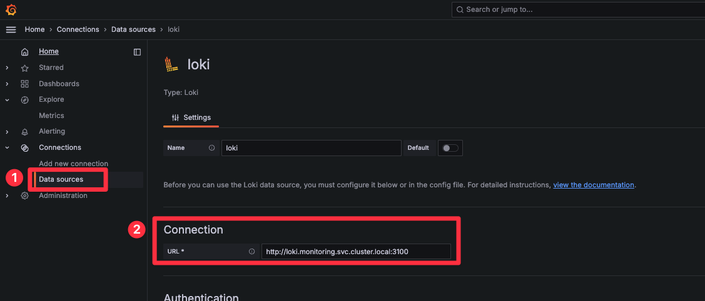
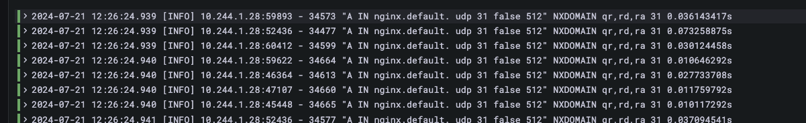

# 개요
* coredns trailing dot(.)기능을 평가하기 위해 스트레스 테스트

# 준비
## kind cluster 생성

```sh
kind create cluster --config ./kind-config.yaml
```

## kind nginx ingress controller 설치

```sh
kubectl apply -f https://raw.githubusercontent.com/kubernetes/ingress-nginx/main/deploy/static/provider/kind/deploy.yaml
```

## metrics sever 설치

```sh
kubectl apply -f ./metrics-server/
```

## prometheus operator 설치

```sh
helm repo add prometheus-community https://prometheus-community.github.io/helm-charts
helm repo update

helm upgrade --install \
  -n monitoring --create-namespace \
  -f ./manifests/prometheus-operator/values.yaml \
  metric-monitoring prometheus-community/kube-prometheus-stack
```

## loki-stack 설치

```sh
helm repo add grafana https://grafana.github.io/helm-charts
helm upgrade --install \
  --version 2.10.2 \
  -n monitoring --create-namespace \
  -f ./manifests/loki-stack/values.yaml \
  loki grafana/loki-stack
```

## hosts파일 수정
* prometheus, grafana에 접속할 수 있도록 hosts파일 수정

```sh
echo prometheus.localtest.com >> /etc/hosts
echo grafana.localtest.com >> /etc/hosts
```

## grafana와 loki 연동
* grafana 접속 주소: grafana.localtest.com
* connection에 loki kubernetes service url설정

```log
url: http://loki.monitoring.svc.cluster.local:3100
```




# grafana 대시보드 추가
* grafana dashboard id: 15762
* 출처: https://grafana.com/grafana/dashboards/15762-kubernetes-system-coredns/

# 실습

## coredns 로그 레벨을 debug로 변경

* Corefile에 log설정 추가

```sh
$ kubectl -n kube-system edit configmap coredns
apiVersion: v1
data:
  Corefile: |
    .:53 {
      ...
      log
    }

```

## nestshoot, nginx, dnsperf 배포

```sh
kubectl apply -f ./netshoot/
kubectl apply -f ./nginx/
kubectl apply -f ./dnsperf/
```

## 옵션1: dnspefr dns 스트레스

* domain 파일 생성

```sh
$ vi domain
nginx.default A
```

* dnsperf 실행

```sh
dnsperf -s 10.96.0.10 -d domain  -l 60 -c 50000
```



## 옵션2: parallel를 사용

```sh
seq 100000 | parallel --jobs 500 'curl -I nginx.default'
```

# 삭제
* kind cluster 삭제

```sh
kind delete cluster --name stress-kind
```

# 참고자료
* 이권수님 블로그: https://www.zerotoexpert.blog/p/resolve-dns-faster-in-a-pod
* grafana dashboard id: https://grafana.com/grafana/dashboards/15762-kubernetes-system-coredns/
* loki-stack helm chart: https://github.com/grafana/helm-charts/tree/main/charts/loki-stack
* https://whchoi98.gitbook.io/k8s/observability/loki
* intergration between loki and grafana issue: https://github.com/grafana/loki/issues/11893
