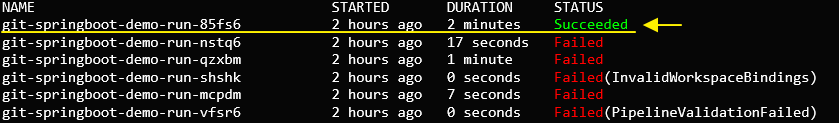
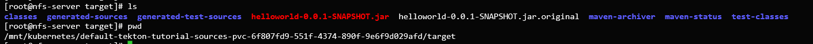

- [개요](#개요)
- [준비](#준비)
- [실행](#실행)
- [pipeline 생성](#pipeline-생성)
- [pipeline 실행](#pipeline-실행)
- [참고자료](#참고자료)

# 개요
텍톤(tekton)을 이용하여 스프링부트 프로젝트를 빌드합니다. git clone으로 프로젝트를 다운로드 받고 maven을 이용하여 프로젝트를 빌드합니다.

<br>

# 준비
* 동적 프로비저닝 활성화

<br>

# 실행
# pipeline 생성
workspace(task전용 공유폴더)를 위한 pvc를 생성합니다.
```sh
kubectl apply -f pvc.yaml
```

maven settings.xml을 configmap으로 등록합니다. default settings.xml를 사용했습니다.
```sh
kubectl apply -f configmap.yaml
```

파이프라인을 생성합니다.
```sh
kubectl apply pipeline.yaml
```

# pipeline 실행
등록한 파이프라인을 실행합니다.
```sh
tkn pipeline start git-springboot-demo \
--workspace name=source,claimName=tekton-tutorial-sources \
--workspace name=maven-settings,config=maven-settings
```

파이프라인이 성공적으로 실행되면 Succeeded메세지가 보입니다.



pvc가 마운트 된 경로로 이동하면 helloworld-0.0.1-SNAPSHOT.jar가 생성되었습니다.


<br>

# 참고자료
* [1] redhat 텍톤 메뉴얼: https://redhat-scholars.github.io/tekton-tutorial/tekton-tutorial/workspaces.html#ws-create-maven-settings-cm
* [2] 텍톤 공식 메뉴얼: https://github.com/tektoncd/pipeline/blob/main/docs/tutorial.md