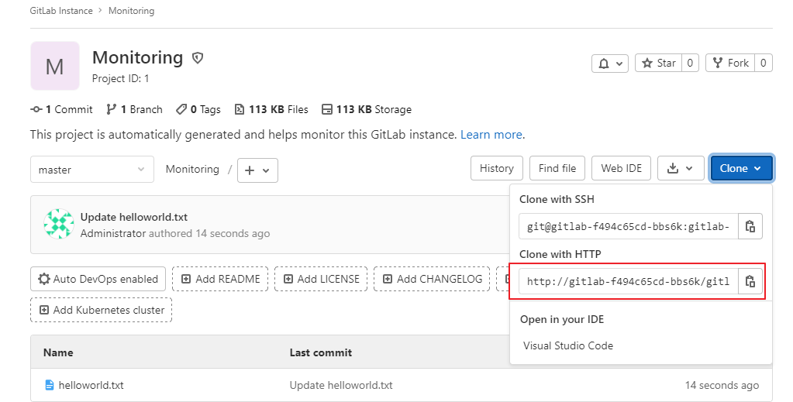

# 개요
* 동적 프로비저닝이 활성화되어 있는 환경에서 gitlab-ce설치
* 설치 대상: 온프레미스

<br>

# 설정
## pvc
* pvc.yaml의 storageclass 변경

<br>

# 설치
* 모든 리소스는 gitlab namespace에 설치됩니다.
```sh
kubectl create ns gitlab
kubectl create -f . 
```

# 설치 후 설정
* externalurl을 ingress.host 또는 nodeport로 변경
```sh
# vi gitlab.rb
external_url 'http://<ip>:<nodeport>'
```

* 설정 전에는 gitlab pod이름이 external_url로 설정


* 설정 후 gitlab 다시 실행
```
kubectl exec -it <gitlab pod> -n gitlab -- gitlab-ctl reconfigure
```

<br>

# 참고자료
* [1] https://www.cnblogs.com/kevingrace/p/14595662.html