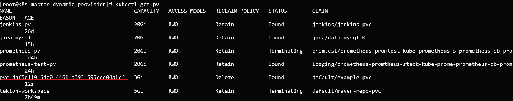

- [개요](#개요)
- [준비](#준비)
- [설치](#설치)
  - [serviceaccount와 role](#serviceaccount와-role)
  - [storageclass 생성](#storageclass-생성)
  - [nfs컨트롤러 pod생성](#nfs컨트롤러-pod생성)
- [동적 프로비저닝 예제](#동적-프로비저닝-예제)
- [Troublshooting](#troublshooting)
- [참고자료](#참고자료)

# 개요
* 온프레미스 환경에서 동적 프로비저닝 활성화

<br>

# 준비
* nfs서버
> https://github.com/choisungwook/portfolio/wiki/nfs문서 참고

<br>

# 설치
## serviceaccount와 role
deployment 권한설정을 위해 serviceaccount생성과 rolebinding을 설정합니다.
```
cd resources
kubectl apply -f role.yaml
```

## storageclass 생성
nfs 전용 storageclass를 생성합니다.
```
cd resources
kubectl apply -f storageclass.yaml
```

## nfs컨트롤러 pod생성
pod는 deployment로 관리됩니다. nfs서버와 공유볼륨을 환경변수에 설정합니다.
```yaml
# resources/deployment.yaml

env:
    - name: PROVISIONER_NAME
    value: nfs
    - name: NFS_SERVER
    value: 192.168.25.132
    - name: NFS_PATH
    value: /mnt/kubernetes
```

deployment에 공유볼륨을 마운트하기 위해 volumes를 설정합니다.
```yaml
# resources/deployment.yaml

volumes:
- name: nfs-client-root
  nfs:
    server: 192.168.25.132
    path: /mnt/kubernetes
```

deployment를 생성합니다.
```sh
cd resources
kubectl apply -f deployment.yaml
```

설치가 성공하면 nfs-client pod가 Running상태입니다.


<br>

# 동적 프로비저닝 예제
pv가 자동으로 생성되면 동적 프로비저닝이 잘 설정된 것입니다.
```
cd /example
kubectl apply -f example.yaml
```



<br>

# Troublshooting
* 쿠버네티스 1.20버전 이후 컨테이너 이미지 변경 필요
> 참고자료: https://github.com/kubernetes-sigs/nfs-subdir-external-provisioner/pull/26

<br>

# 참고자료
* [1] https://github.com/justmeandopensource/kubernetes/tree/master/yamls/nfs-provisioner
* [2] helm: https://github.com/kubernetes-sigs/nfs-subdir-external-provisioner