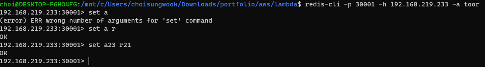

# 개요
* redis-cluster 템플릿
* statefulsets static IP 설정을 몰라 deployment로 대체

<br>

# 사전 지식
## redis
* redis-cluster 생성 방법
* redis-proxy
* calico static IP 설정

## docker
* docker build
* docker push

## Vagrant
* vagrant up
* vagrant ssh

<br>

# 준비
* worker-node 3대
* deployment 설정
  * static ip
  * nodeselector

# 예제 실행
## 레디스 클러스터 컨테이너 생성
```
kubectl apply -f .
```

## 클러스터 생성
* -a: 비번
* cluster-replicas: slave갯수 0

```sh
kubectl exec -it redis-0-xx -- redis-cli --cluster create -a toor --cluster-replicas 0 10.233.96.20:6379 10.233.96.21:6379 10.233.96.22:6379
```


## 클러스터 동작 확인
* 값을 저장할 때 리다이렉트 되는지 확인
```sh
kubectl exec -it redis-cluster-0-545d599846-ngt5t -- redis-cli -c -a toor -h 10.233.96.20 -p 6379
```


## 레디스 클러스터 프록시 생성
```sh
cd proxy
kubectl apply -f .
```

## 레디스 외부 접속
```sh
redis-cli -p 30001 -h [node IP] -a toor
```



## 클러스터와 프록시 연동 확인
* 프록시에서 저장한 값이 클러스터에서 불러지는지 확인
* 값 저장
```
set user aa
```

* 값 로드
```
get user
```

# redis-cluster 삭제 후 다시 확인
* pv와 nodeselector, staticIP가 설정되어 있기 때문에 컨테이너 삭제 후, 다시 실행해도 유지 

# 참고자료
* [1] [redis-cluster proxy 예제](https://blog.csdn.net/coco3848/article/details/107611924)
* [2] [git redis-proxy](https://github.com/RedisLabs/redis-cluster-proxy.git)