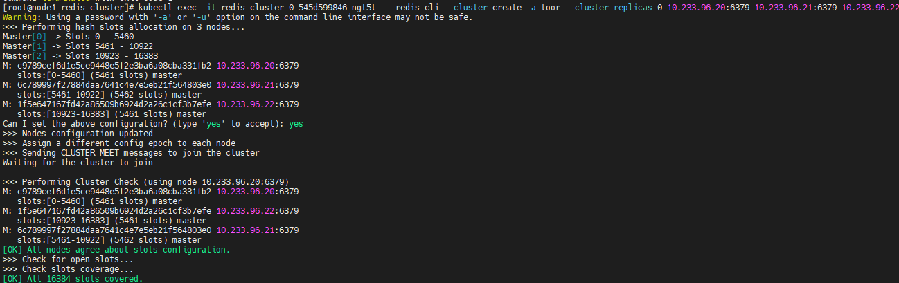
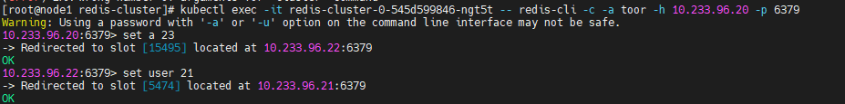

# 개요
* redis-cluster 템플릿

<br>

# 사전 지식
## redis
* redis-cluster 생성 방법
* redis-proxy
* calico static IP 설정

## docker
* docker build
* docker push

## Vagrant
* vagrant up
* vagrant ssh

<br>

# 준비
* worker-node 3대

# 예제 실행
```
kubectl apply -f .
```

## 클러스터 생성
* -a: 비번
* cluster-replicas: slave갯수 0

```sh
kubectl exec -it redis-0-xx -- redis-cli --cluster create -a toor --cluster-replicas 0 10.233.96.20:6379 10.233.96.21:6379 10.233.96.22:6379
```



## 클러스터 동작 확인
* 값을 저장할 때 리다이렉트 되는지 확인
```sh
kubectl exec -it redis-cluster-0-545d599846-ngt5t -- redis-cli -c -a toor -h 10.233.96.20 -p 6379
```

