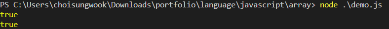
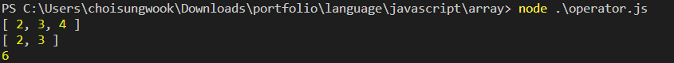

# 개요
* 배열 생성

# 배열 생성
* []로 생성
* 또는 new Array()클래스 사용

# 배열의 타입은 object이다.
```javascript
const arr = [1, 2, 3];
const arr2 = new Array(1, 2, 3);

console.log(typeof arr === "object")
console.log(typeof arr2 === "object")
```



# 배열 값 출력
* Object 함수를 사용하거나 그냥 출력
```javascript
const arr = [1, 2, 3];
const arr2 = new Array(1, 2, 3);

console.log(arr);
console.log(Object.values(arr));
```

# 연산자
* 연산 후 새로운 배열을 생성
* 기존 배열은 변경하지 않음
* reduce: 오른쪽 값부터 시작해서 누적
```javascript
const arr = [1, 2, 3]

console.log(arr.map(item => item + 1));
console.log(arr.filter(item => item >= 2));
console.log(arr.reduce((acc, item) => acc + item, 0)); // 0부터 시작해서 누적
```

