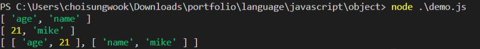
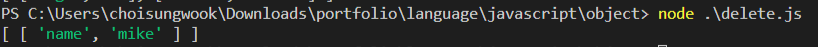

# 객체 생성
```javascript
const obj = {
    age: 21,
    name: 'mike'
}
```

# 키, 값, 엔트리 출력
```javascript
const obj = {
    age: 21,
    name: 'mike'
};

console.log(Object.keys(obj));
console.log(Object.values(obj));
console.log(Object.entries(obj));
```




# 키 삭제
```javascript
const obj = {
    age: 21,
    name: 'mike'
};

delete obj['age']

console.log(Object.entries(obj));
```

