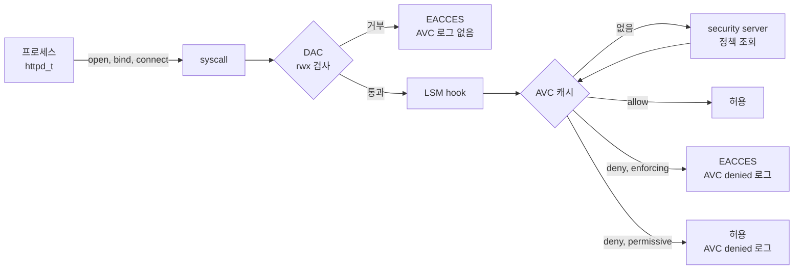

# SELinux 개념

SELinux는 root 권한까지 포함해 모든 프로세스의 행동을 정책 파일 하나로 제한하는 커널 기능이다. Bottlerocket이 SELinux를 enforcing으로 고정한 이유는 컨테이너가 root로 탈출해도 host 설정과 다른 컨테이너를 건드리지 못하게 하려는 것이다.

## DAC만으로 부족한 이유

리눅스 기본 권한 모델은 DAC(Discretionary Access Control)다.

- 파일 소유자가 rwx 비트로 권한을 정한다
- root(UID 0)는 대부분의 DAC 검사를 건너뛴다
- 그래서 root 프로세스 하나가 탈취되면 host 전체가 넘어간다

MAC(Mandatory Access Control)은 소유자가 아니라 시스템 정책이 권한을 정한다.

- 정책은 부팅 때 커널에 로드되고, 프로세스가 스스로 바꿀 수 없다
- root 프로세스도 정책이 허용한 행동만 한다
- SELinux, AppArmor, Smack이 리눅스의 대표 MAC 구현이다. RHEL 계열과 Bottlerocket은 SELinux, Ubuntu는 AppArmor를 기본으로 쓴다

## 커널 안에서 판정이 일어나는 순서

SELinux는 LSM(Linux Security Module) hook에 붙는다. syscall이 들어오면 DAC 검사를 먼저 하고, 통과한 요청만 SELinux에 묻는다.



- DAC에서 거부되면 SELinux까지 가지 않는다. 그래서 AVC 로그가 없는 Permission denied는 SELinux 문제가 아니다
- AVC(Access Vector Cache)는 판정 결과 캐시다. 같은 조합을 매번 정책에서 찾지 않는다
- 거부 로그도 AVC라는 이름으로 audit.log에 남는다

## label이 전부다

SELinux는 경로나 UID를 보지 않는다. 프로세스와 대상에 붙은 label(security context)만 본다.

label 형식은 `user:role:type:level`이다.

```text
system_u:system_r:httpd_t:s0              # nginx 프로세스
system_u:object_r:httpd_sys_content_t:s0  # /usr/share/nginx/html/index.html
```

| 필드 | 의미 | 실무에서 보는 빈도 |
|---|---|---|
| user | SELinux 사용자. 리눅스 계정과 별개 | 거의 안 봄 |
| role | RBAC용 역할. 파일은 항상 `object_r` | 거의 안 봄 |
| type | 판정의 핵심. 프로세스의 type은 domain이라 부름 | 매번 |
| level | MLS/MCS 등급과 category. 컨테이너 격리에 씀 | 컨테이너에서 |

- 파일의 label은 확장 속성(xattr) `security.selinux`에 저장된다
- 프로세스의 label은 실행 파일의 label에 따라 정해진다. 이를 domain transition이라 한다
- `ls -Z`, `ps -eZ`, `id -Z`로 본다

## Type Enforcement

정책의 대부분은 "어느 domain이 어느 type에 무엇을 할 수 있다"는 allow 규칙이다.

```text
allow httpd_t httpd_sys_content_t:file { read open getattr };
```

- 규칙에 없으면 거부다. 기본값이 deny인 whitelist 모델이다
- 같은 root라도 `httpd_t`로 도는 nginx는 `/root`의 `admin_home_t` 파일을 읽지 못한다
- 파일을 `mv`하면 label이 따라간다. `/root`에서 만든 파일을 웹 루트로 옮기면 `admin_home_t` 그대로라 403이 난다. 가장 흔한 SELinux 장애다

domain transition은 다음 규칙으로 정해진다. systemd(`init_t`)가 `httpd_exec_t` label이 붙은 `/usr/sbin/nginx`를 실행하면 새 프로세스가 `httpd_t`가 된다.

```text
type_transition init_t httpd_exec_t:process httpd_t;
```

## 모드

| 모드 | 거부 규칙 적용 | AVC 로그 | 용도 |
|---|---|---|---|
| enforcing | 적용 | 남음 | 운영 |
| permissive | 적용 안 함 | 남음 (`permissive=1`) | 정책 개발, 장애 원인 분리 |
| disabled | SELinux 꺼짐 | 없음 | 쓰지 않는 것을 권장. 다시 켜면 전체 relabel 필요 |

- `setenforce 0/1`은 재부팅 전까지만 유효하다. 영구 설정은 `/etc/selinux/config`
- domain 하나만 permissive로 둘 수 있다. `semanage permissive -a httpd_t`
- Amazon Linux 2023은 permissive가 기본이다. RHEL, Fedora는 enforcing, Bottlerocket은 enforcing이고 끌 수 없다

## 정책을 고치지 않고 조정하는 3가지 수단

정책 원본을 고치는 것은 마지막 수단이다. 대부분의 거부는 아래 3가지로 끝난다.

| 수단 | 명령 | 언제 |
|---|---|---|
| 파일 label 규칙 | `semanage fcontext -a -t <type> '<경로 정규식>'` + `restorecon -Rv <경로>` | 비표준 경로에 데이터를 둘 때 |
| 포트 label | `semanage port -a -t http_port_t -p tcp 8765` | 비표준 포트로 listen할 때 |
| boolean | `setsebool -P httpd_can_network_connect on` | 정책 작성자가 미리 만들어 둔 선택 기능을 켤 때 |

- `chcon`으로 바꾼 label은 relabel 때 사라진다. 영구 변경은 `semanage fcontext`에 규칙을 넣고 `restorecon`으로 적용한다
- `audit2allow`로 모듈을 만드는 것은 위 3가지로 해결되지 않을 때만 한다. 거부 로그를 그대로 allow로 바꾸면 막아야 할 행동까지 열 수 있다

## AVC 로그 읽는 법

거부되면 audit.log에 한 줄이 남는다.

```text
type=AVC msg=audit(1727165000.123:412): avc:  denied  { read } for  pid=2481 comm="nginx"
  name="moved.html" dev="nvme0n1p1" ino=1234
  scontext=system_u:system_r:httpd_t:s0
  tcontext=unconfined_u:object_r:admin_home_t:s0
  tclass=file permissive=0
```

| 필드 | 읽는 법 |
|---|---|
| `{ read }` | 거부된 권한 |
| `comm` | 누가 |
| `scontext` | 요청한 프로세스의 label. 여기서는 `httpd_t` |
| `tcontext` | 대상의 label. 여기서는 `admin_home_t` |
| `tclass` | 대상 종류. file, dir, tcp_socket 등 |
| `permissive` | 0이면 실제로 거부, 1이면 기록만 |

- `ausearch -m AVC -ts recent`로 최근 거부만 본다
- `ausearch -m AVC -ts recent | audit2why`가 원인이 label인지 boolean인지 알려 준다

## MCS와 컨테이너 격리

컨테이너는 모두 같은 `container_t` type으로 돈다. type만으로는 컨테이너 A가 컨테이너 B의 파일을 읽는 것을 막을 수 없다. 이 틈을 level 필드의 category(MCS, Multi-Category Security)가 막는다.

```text
컨테이너 A 프로세스  system_u:system_r:container_t:s0:c1,c2
컨테이너 A 파일      system_u:object_r:container_file_t:s0:c1,c2
컨테이너 B 프로세스  system_u:system_r:container_t:s0:c3,c4
```

- 컨테이너 런타임이 컨테이너마다 서로 다른 category 쌍을 무작위로 붙인다
- 프로세스의 category가 대상의 category를 포함해야 접근할 수 있다
- 그래서 type 규칙이 허용해도 B는 A의 파일을 읽지 못한다

type은 "컨테이너가 host에 무엇을 할 수 있나"를, category는 "컨테이너끼리 무엇을 할 수 있나"를 정한다.

## 다음 단계

- 판정 과정을 조작하며 보려면 [시각화 페이지](../visualize/index.html)를 연다
- 직접 거부를 만들고 고쳐 보려면 [5-selinux-handson.md](5-selinux-handson.md)로 간다
