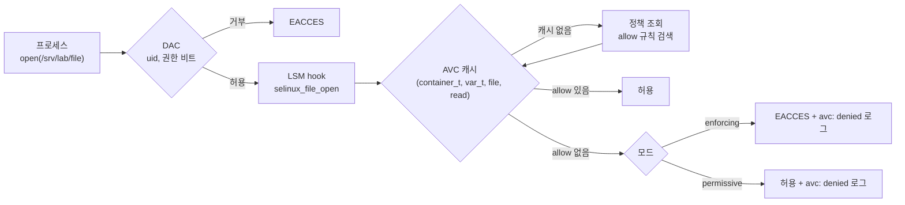
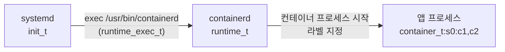

# SELinux 원리

SELinux는 파일 권한 비트(DAC) 검사를 통과한 요청을 커널이 한 번 더 검사하는 MAC(Mandatory Access Control)이다. 판단 기준은 사용자 ID가 아니라 프로세스와 파일에 붙은 라벨이다. 그래서 root 프로세스도 정책에 allow 규칙이 없으면 거부된다.

## DAC와 MAC

| 구분 | DAC | SELinux(MAC) |
|---|---|---|
| 판단 기준 | uid, gid, 권한 비트 | 프로세스 라벨과 대상 라벨 |
| 규칙을 정하는 주체 | 파일 소유자 | 시스템 정책. 소유자가 바꿀 수 없음 |
| root | 거의 모든 검사를 건너뜀 | 예외 없음 |
| 규칙이 없을 때 | 권한 비트대로 | 거부(default deny) |

- 두 검사는 AND다. DAC에서 거부되면 SELinux까지 가지 않는다
- 컨테이너 탈출을 가정하면 차이가 커진다. 탈출한 프로세스가 host의 root여도 라벨은 여전히 컨테이너 라벨이라 host 파일에 쓰지 못한다

## 라벨(security context)

모든 프로세스와 파일에 `user:role:type:level` 형식의 라벨이 붙는다.

| 필드 | 예 | 역할 |
|---|---|---|
| user | `system_u` | SELinux 사용자. Linux 계정과 별개 |
| role | `system_r` | 어떤 type으로 들어갈 수 있는지 제한 |
| type | `container_t` | 판정의 핵심. 정책 규칙 대부분이 type 기준 |
| level | `s0:c123,c456` | MLS/MCS. 같은 type끼리 다시 나눌 때 씀 |

- 프로세스의 type은 도메인(domain), 파일의 type은 그냥 type이라고 부른다
- 파일 라벨은 확장 속성 `security.selinux`에 저장된다. `ls -Z`가 이 값을 읽는다
- 프로세스 라벨은 `/proc/<pid>/attr/current`에 있다. `ps -eZ`, `id -Z`가 이 값을 읽는다
- 경로별 기본 라벨은 정책의 `file_contexts`에 있다. `restorecon`이 이 표대로 라벨을 다시 붙인다

## 판정 흐름

syscall 하나가 SELinux 판정을 받는 순서다.

- 판정 입력은 4가지다. source type, target type, 객체 class(`file`, `dir`, `tcp_socket` 등), 권한(`read`, `write`, `execute` 등)
- 정책 규칙은 `allow container_t container_file_t:file { read write open };` 형식이다
- AVC(Access Vector Cache)는 판정 결과를 캐시한다. 같은 조합은 정책을 다시 찾지 않는다
- 거부는 audit 로그에 `avc: denied`로 남는다. 원인 분석은 거의 이 한 줄에서 시작한다

## 모드

| 모드 | 거부 규칙 적용 | 로그 | 용도 |
|---|---|---|---|
| enforcing | 적용 | 남김 | 운영 |
| permissive | 적용 안 함 | 남김 | 정책 도입 전 영향 조사 |
| disabled | 정책 미적재 | 없음 | 다시 켜려면 전체 relabel 필요 |

- `setenforce 0/1`은 enforcing과 permissive 사이만 바꾼다. 재부팅하면 `/etc/selinux/config` 값으로 돌아간다
- permissive에서 쌓인 `avc: denied`는 enforcing으로 바꿨을 때 실패할 목록이다
- AL2023은 permissive가 기본이다. 같은 워크로드가 AL2023에서 되고 Bottlerocket(enforcing 고정)에서 실패하는 이유가 이 차이다

## 도메인 전이

프로세스의 type은 실행한 파일의 라벨로 바뀐다. 정책에 `type_transition` 규칙이 있어서다.

- 같은 root라도 어떤 바이너리로 시작했는지에 따라 도메인이 다르다
- 컨테이너 런타임은 exec 전에 다음 프로세스의 라벨을 지정한다(`/proc/self/attr/exec`)
- 위 type 이름은 Bottlerocket 정책 기준이다. 일반 배포판(targeted 정책)은 `container_runtime_t`처럼 이름이 다르다

## MCS: 같은 type끼리 격리

컨테이너는 모두 `container_t`라서 type만으로는 컨테이너 A가 컨테이너 B의 파일을 읽는 것을 구분하지 못한다. MCS(Multi-Category Security)가 level 필드로 이 구분을 더한다.

| 프로세스 | 파일 | 결과 |
|---|---|---|
| `container_t:s0:c1,c2` | `container_file_t:s0:c1,c2` | 허용 |
| `container_t:s0:c1,c2` | `container_file_t:s0:c3,c4` | 거부. category가 다름 |
| `container_t:s0:c1,c2` | `container_file_t:s0` | 허용. category 없는 파일은 공유 |

- 런타임은 컨테이너마다 category 쌍을 무작위로 붙인다
- docker `-v host:ctr:z`는 category 없는 공유 라벨, `:Z`는 그 컨테이너 전용 category 라벨을 붙인다

## 컨테이너에서 자주 만나는 type

| type | 붙는 곳 | 뜻 |
|---|---|---|
| `container_t` | 일반 컨테이너 프로세스 | 제한된 도메인 |
| `spc_t` | `--privileged`, `label=disable` 컨테이너 | Super Privileged Container. 거의 제한 없음 |
| `container_file_t` | 컨테이너가 쓸 수 있는 파일 | `:z`, `:Z`로 relabel한 볼륨 |
| `var_t`, `default_t`, `etc_t` 등 | host 파일 | `container_t`가 쓰지 못함 |

Bottlerocket 정책이 이 이름들을 어떻게 다시 정의하는지는 [8-bottlerocket-mapping.md](8-bottlerocket-mapping.md)에 있다. 실습은 [6-selinux-handson.md](6-selinux-handson.md)에서 한다.
