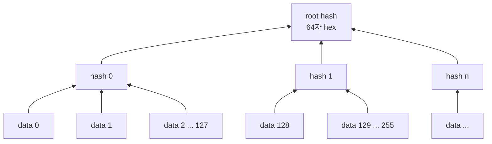
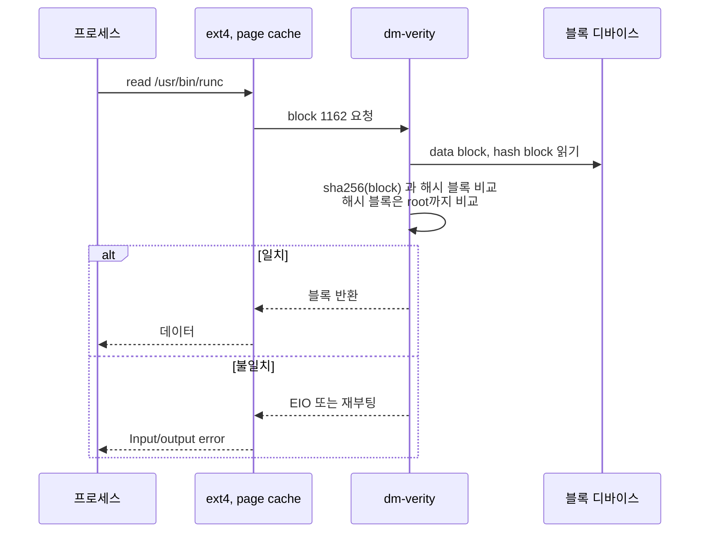
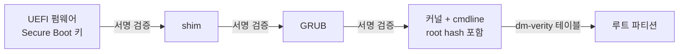

# dm-verity 개념

dm-verity는 읽기 전용 블록 디바이스의 블록을 읽을 때마다 해시 트리로 검증하는 device-mapper target이다. Bottlerocket은 루트 파티션에 dm-verity를 걸어, 디스크에 있는 OS 이미지가 빌드 때와 1비트라도 다르면 재부팅한다.

## 읽기 전용 마운트만으로 부족한 이유

- `mount -o ro`는 파일시스템 계층의 약속이다. 블록 디바이스(`/dev/nvme0n1p3`)에 직접 쓰면 우회된다
- 오프라인 공격도 있다. EBS 스냅샷을 떼어 다른 인스턴스에서 바이너리를 바꾸고 다시 붙이는 경우다
- 파일 단위 서명(IMA 등)은 파일마다 검사 비용이 들고, 파일시스템 메타데이터 변조는 막지 못한다

dm-verity는 파일이 아니라 블록 단위로 본다. 파일 내용, 디렉터리, inode, 슈퍼블록까지 전부 블록이라 한 번에 보호된다.

## 해시 트리 구조

데이터를 4KiB 블록으로 나누고, 블록마다 SHA-256 해시를 만든다. 그 해시들을 다시 4KiB 해시 블록에 담고 해시를 만드는 과정을 하나가 남을 때까지 반복한다. 마지막 하나가 root hash다.

- 해시 블록 하나(4KiB)에 SHA-256(32바이트) 해시 128개가 들어간다
- [로컬 실습](6-dm-verity-handson.md)의 8MiB 이미지는 데이터 블록 2048개, 해시 블록 17개였다. leaf 16개(2048 ÷ 128)와 그 위 1개다
- 해시 트리는 데이터와 별도 디바이스에 두거나, 같은 디바이스 뒤쪽에 붙인다. Bottlerocket은 루트 파티션 뒤에 붙인다
- 신뢰해야 하는 값은 root hash 64자 하나뿐이다. 나머지 해시는 디스크에 있어도 root hash로 검증된다

## 검증은 읽을 때 한다

부팅 때 전체를 검사하지 않는다. 블록을 처음 읽을 때 그 블록에서 root까지 경로만 확인한다.

- 한 번 검증한 해시 블록은 캐시하므로 이후 읽기의 추가 비용은 작다
- 부팅 시간이 이미지 크기에 비례해 늘지 않는다
- 반대로 한 번도 읽지 않은 블록의 변조는 읽기 전까지 모른다

## 불일치를 찾았을 때 동작

`veritysetup open`의 옵션이나 커널 테이블 인자로 정한다.

| 동작 | 결과 | 쓰는 곳 |
|---|---|---|
| 기본값 | 그 읽기만 EIO. 시스템은 계속 동작 | 일반 데이터 볼륨 |
| `restart_on_corruption` | 커널 재시작 | Bottlerocket 루트 |
| `panic_on_corruption` | 커널 panic | 덤프가 필요한 환경 |
| `ignore_corruption` | 로그만 남기고 변조된 데이터 반환 | 디버깅 |

Bottlerocket이 재시작을 고른 이유는 fail closed다. 변조된 OS로 계속 도는 노드는 무엇을 하는지 알 수 없는 노드다. 재부팅하면 노드가 NotReady가 되고 교체 대상이 된다.

## root hash를 누가 넘기는가

root hash가 공격자 손에 있으면 dm-verity는 무력하다. 공격자가 데이터를 바꾸고 해시 트리를 새로 만들면 트리 안에서는 앞뒤가 맞는다. [로컬 실습](6-dm-verity-handson.md)의 5단계가 이 상황이다.

그래서 root hash는 변조할 수 없는 경로로 커널에 전달한다.

- 커널 cmdline에 root hash를 넣고, cmdline까지 서명 검증 대상에 포함한다
- 또는 root hash에 대한 서명을 커널 keyring으로 검증한다(`CONFIG_DM_VERITY_VERIFY_ROOTHASH_SIG`)
- Bottlerocket은 Secure Boot가 가능한 인스턴스에서 부트로더부터 이 체인을 닫는다

## dm-verity가 막지 못하는 것

- 쓰기 가능한 파티션. Bottlerocket의 `/local`, `/var`, 컨테이너 이미지 저장소는 보호 대상이 아니다
- 이미 메모리에 올라간 코드의 변조
- 정상 바이너리를 악용하는 공격

그래서 SELinux가 함께 있다. dm-verity는 "디스크의 OS가 원본인가"를, SELinux는 "실행 중인 프로세스가 허용된 행동만 하는가"를 맡는다.

## 다음 단계

- 해시 트리를 직접 변조해 보려면 [시각화 페이지](../visualize/index.html)를 연다
- 실제 이미지로 해 보려면 [6-dm-verity-handson.md](6-dm-verity-handson.md)로 간다
