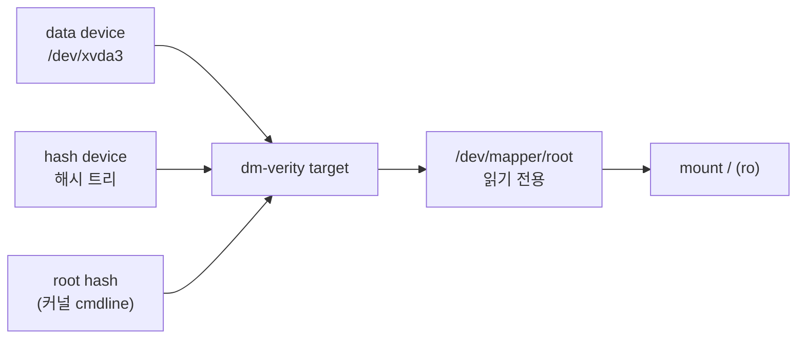
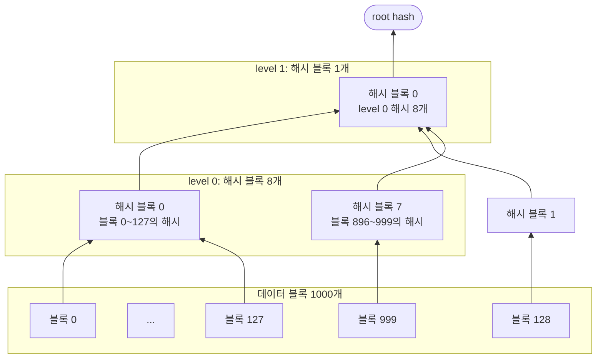
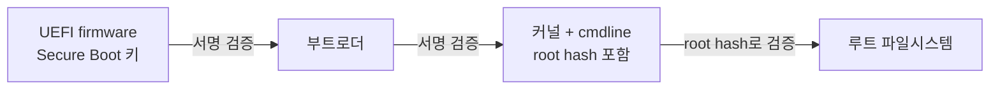

# dm-verity 원리

dm-verity는 읽기 전용 블록 디바이스의 블록을 읽을 때마다 해시 트리와 대조하는 device-mapper target이다. 신뢰할 값은 32바이트 root hash 하나다. root hash만 변조되지 않으면 디바이스의 어느 바이트가 바뀌어도 그 블록을 읽는 순간 검증에 실패한다.

## 구성 요소

| 요소 | 내용 |
|---|---|
| data device | 검증 대상. 파일시스템 이미지 그대로 |
| hash device | 해시 트리. 별도 파일이나 같은 디바이스 뒷부분에 둔다 |
| root hash | 트리 꼭대기 해시. 커널 cmdline이나 서명으로 전달 |
| salt | 해시할 때 앞에 붙이는 값. 미리 계산한 해시 표를 쓰지 못하게 함 |

## 해시 트리

블록 크기 4096, sha256(32바이트) 기준으로 해시 블록 하나에 해시 128개가 들어간다.

- level 0: 데이터 블록마다 `sha256(salt || 데이터 블록)`을 계산해 128개씩 해시 블록에 담는다. 남는 공간은 0으로 채운다
- level 1: level 0 해시 블록마다 같은 방식으로 해시를 계산해 다시 128개씩 담는다
- 해시 블록이 1개가 될 때까지 반복한다
- root hash: 마지막 해시 블록 1개의 `sha256(salt || 블록)`

데이터 크기에 따른 트리 깊이다.

| 데이터 블록 수 | 크기 | level 0 | level 1 | level 2 | 해시 블록 합계 |
|---:|---:|---:|---:|---:|---:|
| 1,000 | 약 4MB | 8 | 1 | - | 9 |
| 20,000 | 약 82MB | 157 | 2 | 1 | 160 |
| 262,144 | 1GiB | 2,048 | 16 | 1 | 2,065 |

- 128개씩 묶으므로 한 단계 올라갈 때마다 블록 수가 1/128로 준다. 1GiB도 3단이면 끝난다
- 해시 트리 크기는 데이터의 약 0.8%(1/128)다

## hash device 배치

`veritysetup format`이 만든 hash device의 앞부분이다. 4MB 예제 실측값이다.

| 오프셋 | 내용 |
|---:|---|
| 0 | superblock. `verity` 매직, salt, 블록 크기, 알고리즘 |
| 4096 | level 1(최상위) 해시 블록 |
| 8192 | level 0 해시 블록 8개. 첫 32바이트가 데이터 블록 0의 해시 |

- 상위 level이 앞에 온다
- superblock에 root hash는 없다. root hash를 hash device 안에 두면 공격자가 트리와 함께 바꿀 수 있어서다

## 검증 시점

- 마운트할 때 전체를 검사하지 않는다. 블록을 읽는 순간 그 블록에서 root까지 경로만 검증한다
- 1GiB 디바이스라도 블록 하나 읽을 때 검증하는 해시 블록은 3개다
- 검증을 통과한 해시 블록과 데이터는 page cache에 남는다. 이미 캐시된 블록은 원본 디스크가 바뀌어도 다시 검증하지 않는다
- 부팅 시간이 이미지 크기에 비례해 늘지 않는 이유가 이 지연 검증이다

## 검증에 실패하면

| 옵션 | 동작 |
|---|---|
| 기본값 | 그 읽기 요청이 EIO(`Input/output error`)로 실패 |
| `ignore_corruption` | 로그만 남기고 변조된 데이터를 반환 |
| `restart_on_corruption` | 커널 재시작 |
| `panic_on_corruption` | 커널 panic |

- 루트 파일시스템에 기본값(EIO)을 쓰면 일부 바이너리만 실행에 실패한 채 노드가 계속 돈다. 변조된 노드가 반쯤 살아 있는 상태다
- Bottlerocket은 재시작을 택했다. 변조를 알아챈 노드를 계속 돌리지 않는다

## 읽기 전용이어야 하는 이유

- 블록 하나를 쓰면 그 블록에서 root까지 해시가 전부 바뀐다. 그러면 root hash도 바뀌고, 미리 받은 root hash와 맞지 않는다
- 그래서 dm-verity target은 쓰기를 받지 않는다. 쓰기가 필요한 영역은 dm-verity 밖에 둔다
- Bottlerocket의 `/etc`(tmpfs), `/local`(데이터 파티션)이 그 영역이다

## root hash는 누가 보장하나

dm-verity 혼자서는 root hash가 진짜인지 모른다. 디스크 전체를 쓸 수 있는 공격자는 데이터, 해시 트리, root hash를 한꺼번에 바꿀 수 있다.

- 체인의 각 단계가 다음 단계를 서명으로 검증한다. root hash는 서명된 커널 cmdline에 들어 있어 따로 바꿀 수 없다
- 다른 방법은 root hash 서명이다. `veritysetup open --root-hash-signature`로 넘기면 커널 keyring의 인증서로 검증한다

## SELinux와 나누는 역할

| 구분 | SELinux | dm-verity |
|---|---|---|
| 막는 것 | 실행 중인 프로세스의 허용되지 않은 접근 | 디스크에 저장된 OS 바이트의 변조 |
| 검사 시점 | syscall마다 | 블록을 읽을 때마다 |
| 우회 조건 | 정책 적재 전, 커널 취약점 | root hash 변조. Secure Boot가 닫음 |
| 실패 결과 | EACCES + avc 로그 | EIO 또는 재시작 |

- SELinux만 있으면 오프라인으로 디스크를 고친 공격을 모른다
- dm-verity만 있으면 쓰기 가능한 영역(`/local`, 컨테이너 볼륨)에서 벌어지는 일을 막지 못한다

로컬 실습은 [4-dm-verity-local-handson.md](4-dm-verity-local-handson.md), 커널 실습은 [7-dm-verity-kernel-handson.md](7-dm-verity-kernel-handson.md)에서 한다.
