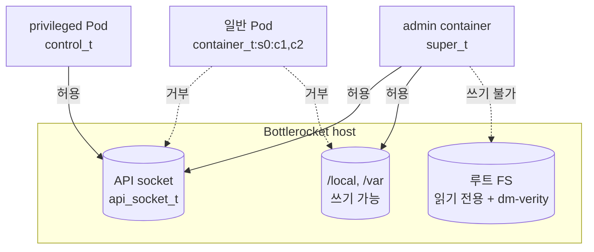

# Bottlerocket에서 본 SELinux와 dm-verity

AL2023에서 익힌 두 기능이 Bottlerocket에서 어떻게 고정돼 있는지 정리한다. 실습 환경은 [aws/bottlerocket의 EC2 환경](../../../aws/bottlerocket/docs/4-setup-ec2.md)을 재사용한다.

- 확인 필요: 이 문서의 출력 예시는 Bottlerocket 공식 문서와 소스 기준 예상값이다. 실측하면 이 줄을 지운다

## AL2023과 무엇이 다른가

| 항목 | AL2023 | Bottlerocket |
|---|---|---|
| SELinux 모드 | permissive 기본, 바꿀 수 있음 | enforcing 고정 |
| 정책 | targeted, 수천 개 type | 자체 정책. 목적이 좁아 type이 적음 |
| 정책 조정 | `semanage`, `setsebool` | 없음. 이미지에 고정 |
| 루트 파일시스템 | 쓰기 가능 | 읽기 전용 + dm-verity |
| dm-verity 변조 시 | 해당 없음 | 커널 재시작 |

Bottlerocket 정책의 목표는 3가지다.

- 대부분의 컴포넌트가 API 설정을 직접 고치지 못하게 한다
- 디스크에 저장된 컨테이너 이미지 아카이브를 고치지 못하게 한다
- 컨테이너가 다른 컨테이너의 layer를 고치지 못하게 한다

## 컨테이너 label 3가지

Bottlerocket에서 조정 대상은 정책이 아니라 컨테이너가 받는 label이다.

| label | 받는 경우 | 할 수 있는 것 |
|---|---|---|
| `container_t` | 일반 컨테이너 기본값 | 자기 파일(`container_file_t`)과 MCS category가 같은 것만 |
| `control_t` | control host container, `privileged: true` Pod | API socket에 쓰기. host 파일 대부분은 여전히 못 고침 |
| `super_t` | admin host container, `seLinuxOptions.type: super_t`를 명시한 Pod | host의 거의 모든 파일 수정. break-glass용 |



- `privileged: true`만 주면 `super_t`가 아니라 `control_t`가 된다. `seLinuxOptions`로 `super_t`를 줘도 `privileged: true`와 함께 쓰면 적용되지 않는 이슈가 있었다
- `super_t`도 루트 파일시스템에는 쓰지 못한다. 그 막음은 SELinux가 아니라 읽기 전용 마운트와 dm-verity가 한다
- 권장은 `container_t` 외 label을 Pod Security 정책으로 막는 것이다

## host에서 label 보기

control container에서 admin container를 거쳐 host 셸로 들어간다. 경로는 [aws/bottlerocket 1-concepts.md](../../../aws/bottlerocket/docs/1-concepts.md)의 host container 절에 있다.

```bash
enter-admin-container
sudo sheltie
```

host에는 `getenforce`, `ps` 같은 도구가 없을 수 있어 `/sys`와 `/proc`을 직접 읽는다. SELinux 모드는 1이 enforcing이다.

```bash
cat /sys/fs/selinux/enforce
```

프로세스마다 label은 `/proc/<pid>/attr/current`에 있다. type별로 센다.

```bash
cat /proc/[0-9]*/attr/current 2>/dev/null | tr '\0' '\n' | cut -d: -f3 | sort | uniq -c | sort -rn
```

예상 결과는 `1`이고, type 목록에 `container_t`, `control_t`, `super_t`가 보인다.

## host에서 dm-verity 보기

루트 디바이스가 verity target인지 확인한다.

```bash
cat /proc/cmdline | tr ' ' '\n' | grep -i -E 'dm-mod|verity|root='
cat /sys/block/dm-*/dm/name
```

- 커널 cmdline에 verity 테이블과 root hash가 들어 있다. cmdline은 부트로더가 넘기고, Secure Boot가 켜진 인스턴스면 부트로더부터 서명 검증 대상이다
- 테이블 형식은 [6-dm-verity-handson.md](6-dm-verity-handson.md) B-2에서 본 것과 같다. 변조 시 동작 인자로 `restart_on_corruption`이 붙는다

루트 파일시스템에 쓰기를 시도한다. 셸 리다이렉션만 쓰므로 host에 별도 도구가 없어도 된다. `super_t` 셸이어도 실패한다.

```bash
echo test > /usr/bin/test-write
```

```text
bash: /usr/bin/test-write: Read-only file system
```

## 운영에서 가져갈 것

- hostPath로 host 파일을 쓰는 DaemonSet은 `container_t`로 거부될 수 있다. AVC 로그는 host의 journal에 남는다. `journalctl -k | grep avc`
- 해결은 label을 올리는 것이지만 `super_t`는 host 전체 권한이다. 필요한 Pod에만, Pod Security 예외로 명시해 준다
- 노드가 이유 없이 재부팅되면 dm-verity 변조 탐지 가능성을 본다. 이전 부팅의 커널 로그에 `verity`가 남는다
- 루트 파일시스템을 고칠 방법은 없다. OS 변경은 새 이미지로 A/B 업데이트한다

## Citations

1. [Bottlerocket SECURITY_FEATURES.md](https://github.com/bottlerocket-os/bottlerocket/blob/develop/SECURITY_FEATURES.md)
2. [Bottlerocket SECURITY_GUIDANCE.md](https://github.com/bottlerocket-os/bottlerocket/blob/develop/SECURITY_GUIDANCE.md)
3. [privileged: true in pod spec clobbers SELinux options (#3791)](https://github.com/bottlerocket-os/bottlerocket/issues/3791)
4. [SELinux super_t label not applied (Discussion #3156)](https://github.com/bottlerocket-os/bottlerocket/discussions/3156)
