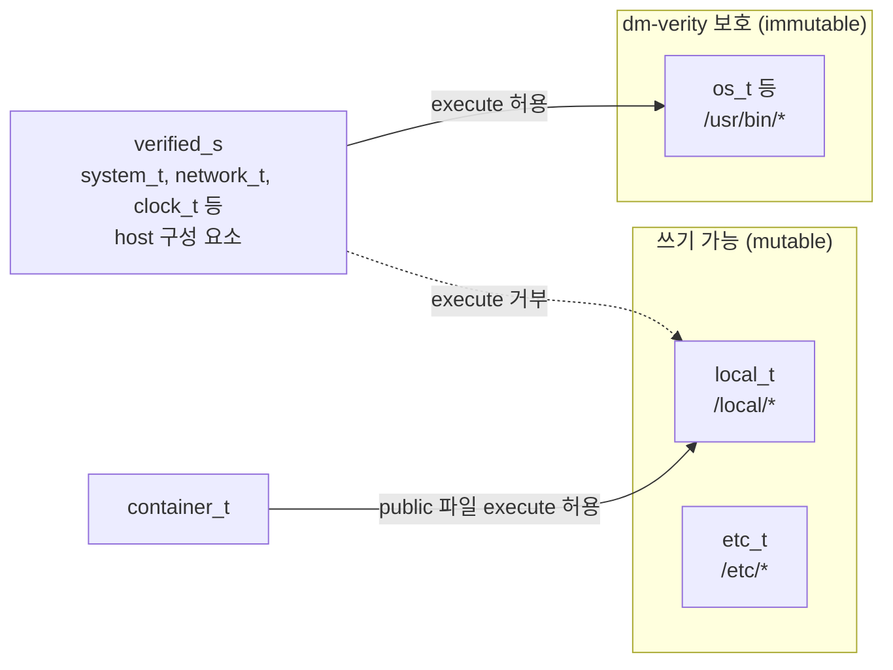

# Bottlerocket에서 SELinux와 dm-verity가 맞물리는 방식

Bottlerocket은 SELinux 정책을 배포판 정책(targeted) 대신 직접 짠 CIL 정책으로 쓴다. 이 정책의 핵심 규칙 하나가 두 기술을 묶는다. OS 구성 요소는 dm-verity가 보호하는 파일만 실행할 수 있다. dm-verity가 "디스크의 OS 바이너리는 원본 그대로"를 보장하고, SELinux가 "OS 구성 요소는 그 바이너리만 실행"을 강제한다.

- 정책 원본: [bottlerocket-core-kit/packages/selinux-policy](https://github.com/bottlerocket-os/bottlerocket-core-kit/tree/develop/packages/selinux-policy)의 `subject.cil`, `object.cil`, `rules.cil`, `lxc_contexts`
- 아래 표는 그 파일의 주석과 선언을 옮긴 것이다

## subject(프로세스) type

| type | 누구 | AL2023 targeted의 비슷한 type |
|---|---|---|
| `kernel_t`, `init_t` | 커널 스레드, PID 1 | 같음 |
| `system_t` | 컨테이너 밖 대부분의 daemon | `unconfined_service_t` 등 |
| `api_t` | 설정 API(apiserver) | 없음 |
| `runtime_t` | containerd, runc | `container_runtime_t` |
| `container_t` | 일반 컨테이너 프로세스 | 같음 |
| `control_t` | privileged 컨테이너, control container | `spc_t`. 정책이 `spc_t`를 `control_t`의 별칭으로 둠 |
| `super_t` | admin container처럼 superpowered host container | 없음 |

- `rules.cil` 주석: runc는 컨테이너 프로세스를 기본 `control_t`로 시작하고, containerd 같은 Go SELinux 런타임이 일반 컨테이너에는 `lxc_contexts`의 `container_t`를 붙인다
- 그래서 privileged pod는 `control_t`다. AL2023에서 `spc_t`가 거의 제한 없던 것과 달리 Bottlerocket에서는 `control_t`보다 위인 `super_t`, `api_t`가 따로 있다
- 설정 저장소를 고칠 수 있는 subject는 `api_t`, `super_t`뿐이다. privileged pod(`control_t`)는 API 설정 파일을 직접 고치지 못한다

## object(파일) type

| type | 무엇 | targeted 별칭 |
|---|---|---|
| `os_t` | OS와 함께 배포된 파일. dm-verity 루트 파일시스템 | - |
| `etc_t` | `/etc`(tmpfs) 설정 파일 | - |
| `local_t` | `/local` 데이터 파티션에 만든 파일 | `container_file_t`, `unlabeled_t` |
| `data_t` | 컨테이너 루트 파일시스템 | - |
| `cache_t` | 컨테이너 이미지 layer | `container_ro_file_t` |
| `state_t`, `secret_t` | 저장된 시스템 상태, 비밀 | - |
| `api_socket_t` | API 소켓 | - |

- `container_file_t`가 `local_t`의 별칭이다. [6-selinux-handson.md](6-selinux-handson.md)의 `:z` 볼륨과 같은 라벨을 Bottlerocket에서는 `/local` 아래 파일이 기본으로 가진다
- 컨테이너 이미지 layer는 `cache_t`다. 정책 목표 중 "디스크의 이미지 수정 금지"가 이 type에 걸린다

## 두 기술이 맞물리는 규칙

`rules.cil`에서 실행 권한에 관한 규칙이다.

| 규칙(주석 원문 요약) | 뜻 |
|---|---|
| verified code만 실행해야 하는 subject는 immutable 객체를 실행할 수 있다. 전부 dm-verity로 보호된다 | host 구성 요소는 루트 파일시스템 바이너리만 실행 |
| 그 subject는 mutable 객체를 실행할 수 없다 | `/local`에 바이너리를 두고 host daemon으로 실행하는 경로가 없음 |
| systemd는 immutable 파일만 실행한다(CSI helper 예외) | 새 서비스를 host에 추가할 수 없음 |
| 커널도 정의된 전이 없이는 mutable 객체를 실행하지 못한다 | `forbidden_t` 전이로 최후 방어선 |

- 공격자가 `/local`에 바이너리를 떨어뜨려도 host 구성 요소 권한으로는 실행되지 않는다(SELinux)
- 공격자가 루트 파일시스템 바이너리를 오프라인으로 바꾸면 그 블록을 읽는 순간 검증에 실패하고 재시작한다(dm-verity)
- 둘 중 하나만 있으면 뚫리는 경로가 남는다. [2-dm-verity-concepts.md](2-dm-verity-concepts.md)의 역할 비교 표와 같은 이야기다

## dm-verity 설정

| 항목 | Bottlerocket |
|---|---|
| 보호 대상 | 루트 파티션. A/B 두 세트에 각각 해시 트리 |
| root hash 전달 | 커널 cmdline의 dm-verity 설정 |
| 실패 동작 | 커널 재시작 |
| root hash 신뢰 | Secure Boot 지원 인스턴스에서 부트로더부터 서명 검증 |

- 업데이트는 해시 트리째로 새 이미지를 비활성 파티션에 쓰고 재부팅한다. 블록 단위 패치를 할 수 없는 이유가 dm-verity다

## Bottlerocket 노드에서 확인하는 명령

admin container에서 `sheltie`로 host 셸에 들어간 뒤 실행한다. 접속 방법은 [aws/bottlerocket 3-eks-emergency-access.md](../../../aws/bottlerocket/docs/3-eks-emergency-access.md)에 있다.

| 명령 | 확인할 것 |
|---|---|
| `cat /sys/fs/selinux/enforce` | `1`. enforcing |
| `cat /proc/self/attr/current` | sheltie 셸의 라벨. `super_t` 계열 예상 |
| `ls -Z /usr/bin/containerd` | 루트 파일시스템 바이너리 라벨 |
| `ls -Zd /local` | `local_t` |
| `dmsetup table` | `verity` target 한 줄과 `restart_on_corruption` |
| `grep ' / ' /proc/mounts` | `/dev/dm-0`, `ro` |
| `cat /proc/cmdline` | dm-verity 설정과 root hash |

- 위 결과 열은 정책 원본 기준 예상이다. 실측 결과는 aws/bottlerocket 핸즈온의 knowledge에 남긴다
