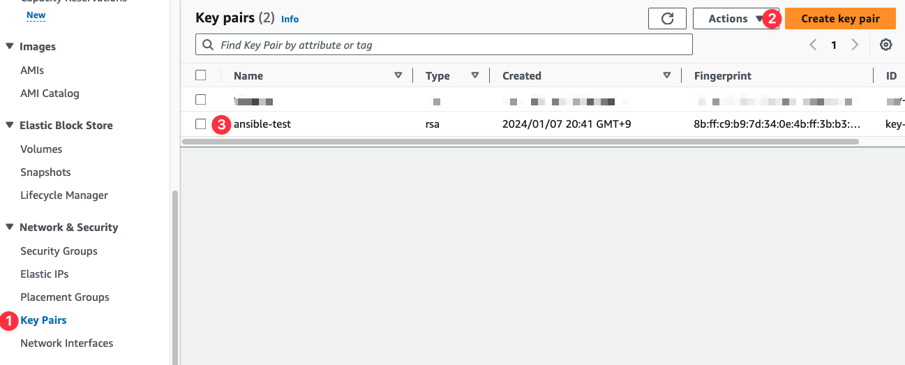
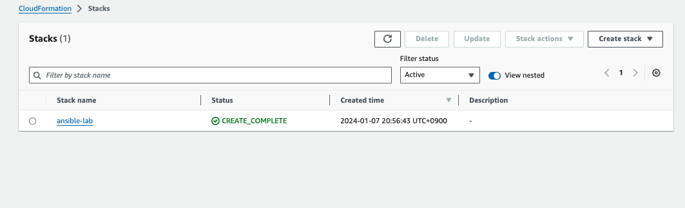

## 개요
* AWS EC2인스턴스를 사용하여 ansible 실습환경 구축

## 제약사항
* 핫스팟을 사용하는 환경은 EC2 인스턴스에 접속 못할 수 있습니다. IP가 고정이 아니기 떄문입니다.

## 준비
* AWS CLI
* Administrator권한을 갖는 AWS 계정 또는 IAM role
* 내 PC public IP 확인: EC2인스턴스에 접속하는 IP를 내PC로 제한하기 위해 IP를 확인

```bash
curl https://ipinfo.io/ip ; echo
```

## 실습환경 구축
* AWS console에서 SSH키를 생성합니다.



* cloudformation 템플릿을 다운로드 받습니다.

```bash
curl -O https://s3.ap-northeast-2.amazonaws.com/cloudformation.cloudneta.net/Ansible/a101-1w.yaml
```

* AWS CLI로 cloudformation 템플릿을 배포합니다.

```bash
EC2_SSHKEY="ansible-test"
aws cloudformation deploy \
  --template-file a101-1w.yaml \
  --stack-name ansible-lab \
  --parameter-overrides KeyName=${EC2_SSHKEY} \
  SgIngressSshCidr=$(curl -s ipinfo.io/ip)/32 \
  --region ap-northeast-2
```

* cloudformation이 배포되면 아래처럼 stack이 생성됩니다.



* SSH키를 사용하여 EC2인스턴스 터미널에 접속합니다. EC2 인스턴스 public IP는 cloudformation output에서 확인할 수 있습니다.

```bash
# EC2인스턴스 public IP확인
EC2_PUBLIC_IP=$(aws cloudformation describe-stacks --stack-name ansible-lab --query 'Stacks[*].Outputs[0].OutputValue' --output text --region ap-northeast-2)
echo $EC2_PUBLIC_IP

# ssh 접속
ssh -i {ssh키 경로} ubuntu@$EC2_PUBLIC_IP
```

## 삭제

```bash
aws cloudformation delete-stack --stack-name ansible-lab --region ap-northeast-2
```
