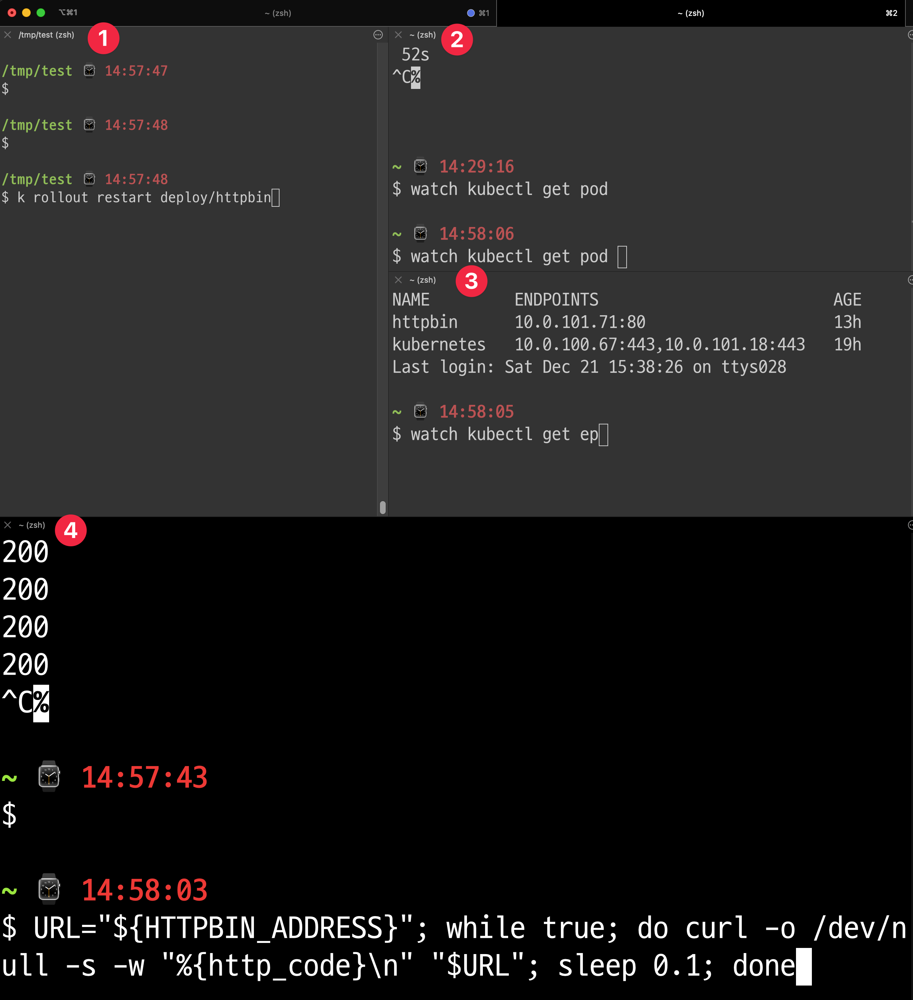
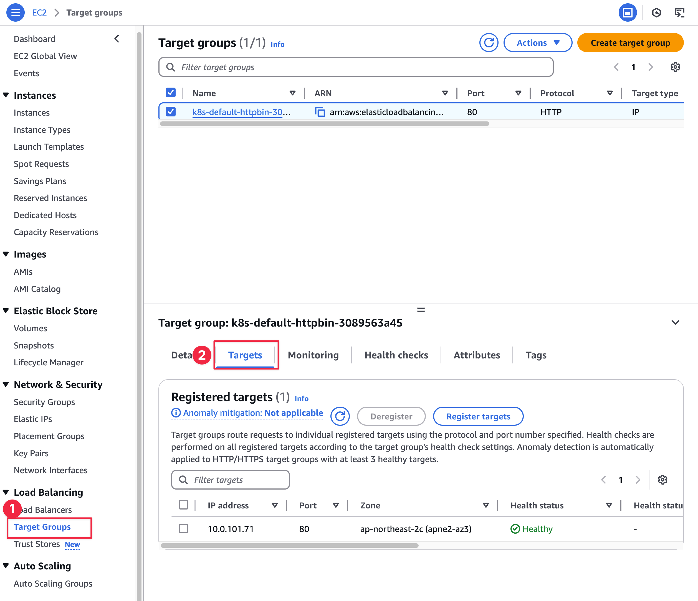
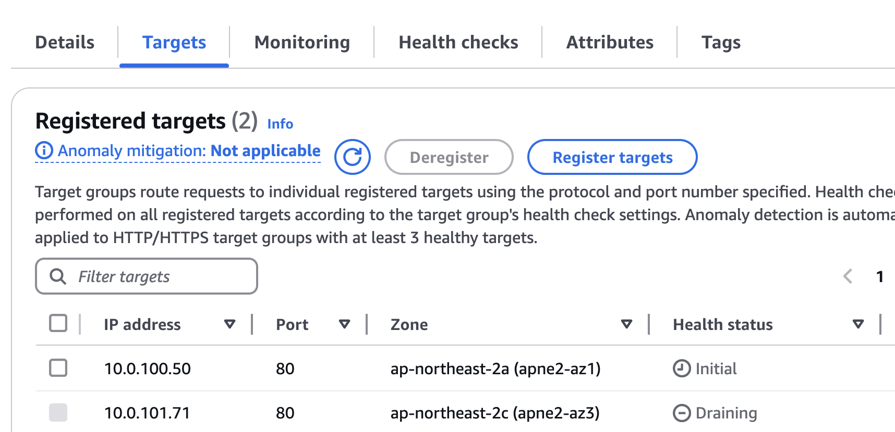
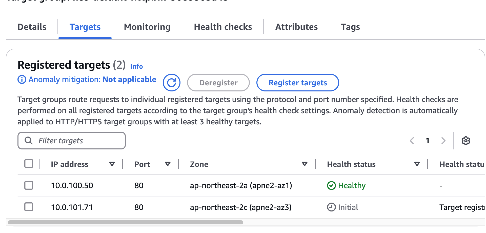
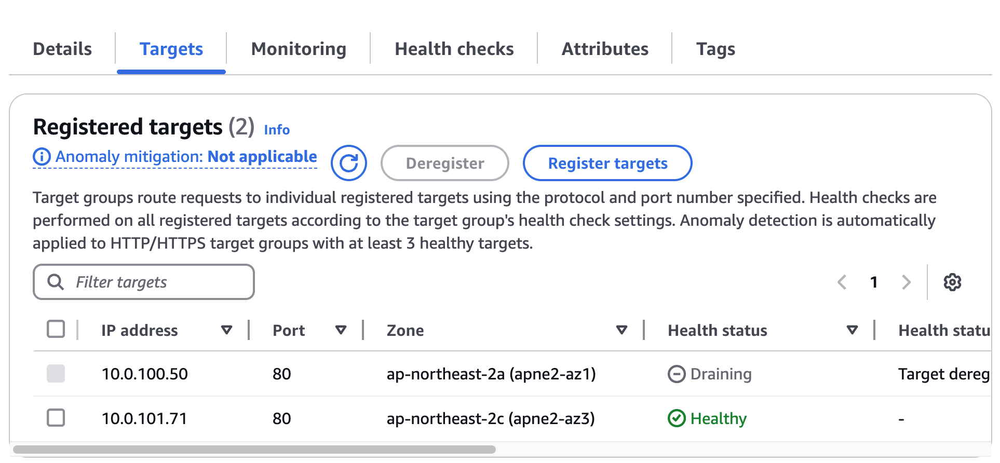

## 개요
* EKS에서 pod Readiness gate 예제

## 실습환경
* EKS 1.30

## 준비
* ALB controller을 설치합니다. 이 예제에서는 helmfile을 사용하여 ALB contorller를 설치합니다.

1. helmfile을 설치합니다.

```sh
brew install helmfile
```

2. helmfile 플러그인을 다운로드 받습니다.

```sh
helmfile init
```

3. ALB controller helm values를 수정합니다. helmfile.yaml에서 environment값을 수정합니다.

```sh
$ cat helmfile.yaml
environments:
  default:
    values:
    - clusterName: {EKS 이름}
      region: {aws region}
      vpcId: {VPC id}
      irsa: {ALB controller IRSA role}
```

4. helmfile을 apply합니다.

```sh
helmfile apply
```

5. ALB contrller설치를 확인합니다.

```sh
$ kubectl -n kube-system get pod -l app.kubernetes.io/instance=aws-load-balancer-controller
NAME                                            READY   STATUS    RESTARTS   AGE
aws-load-balancer-controller-67cc89b776-h7zjq   1/1     Running   0          3m3s
aws-load-balancer-controller-67cc89b776-kv88n   1/1     Running   0          3m3s
```

6. 실습이 끝나면 ALB controller를 삭제합니다.

```sh
helmfile destroy
```

## 예제

### 예제 배포

1. httpbin deployment, service, ingress를 배포하세요.

```sh
kubectl apply -f ./manifests/httpbin/
```

2. pod, ingress가 정상인지 확인합니다.

```sh
$ kubectl get pod,ingress -n default
NAME                          READY   STATUS    RESTARTS   AGE
pod/httpbin-dcc79b8c7-4456k   1/1     Running   0          12m

NAME                                CLASS   HOSTS   ADDRESS                                                                      PORTS   AGE
ingress.networking.k8s.io/httpbin   alb     *       k8s-default-httpbin-xxxxxxxxxxxxxxxxxxxxxx.ap-northeast-2.elb.amazonaws.com   80      5m56s
```

3. ALB 도메인으로 http GET요청을 합니다.

```sh
HTTPBIN_ADDRESS=$(kubectl get ingress httpbin -o jsonpath='{.status.loadBalancer.ingress[0].hostname}')
curl $HTTPBIN_ADDRESS
```

### pod restart 후 curl 요청 에러 확인(에러 재현)

1. 새로운 터미널을 열고 ALB 도메인에 계속 curl을 요청합니다. 그리고 kubectl 상태도 계속 조회하면 좋습니다.



```sh
$ URL="${HTTPBIN_ADDRESS}"; while true; do curl -o /dev/null -s -w "%{http_code}\n" "$URL"; sleep 0.1; done
200
200
```

```sh
watch kubectl get ep
watch kubectl get pod
```

2. AWS console에 로그인한 후 Target Group의 Target를 여세요.




3. 새로운 터미널에서 pod를 재실행합니다.

```sh
kubectl rollout restart deployment/httpbin
```

4. AWS console에서 Target group을 확인해보세요. Target Healthy 상태가 1개도 없습니다.



### 오류 수정

1. default namespace에 readiness gate를 설정하세요.

```sh
kubectl label namespace default elbv2.k8s.aws/pod-readiness-gate-inject=enabled
```

2. pod를 재실행합니다.

```sh
kubectl rollout restart deployment/httpbin
```

3. AWS console에서 Target group을 확인해보세요. 새로운 pod가 target에 추가된 다음 기존 pod가 target에서 제거됩니다.





### pod readiness gate 제거
* pod readiness gate 제거하려면 default namespace에 있는 pod readiness gate label을 삭제합니다.

```sh
kubectl label namespace default elbv2.k8s.aws/pod-readiness-gate-inject-
```

## 참고자료
* https://docs.aws.amazon.com/eks/latest/best-practices/load-balancing.html
* https://kubernetes-sigs.github.io/aws-load-balancer-controller/v2.1/deploy/pod_readiness_gate/
