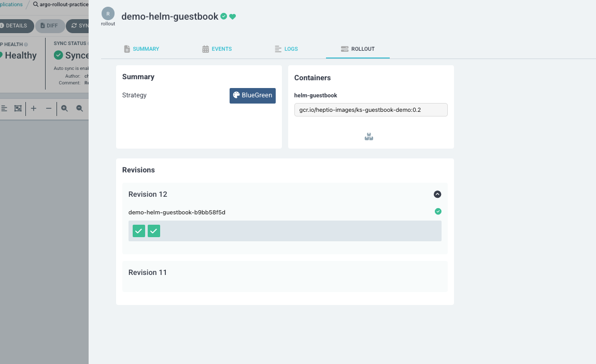

## 유투브 링크
[argoCD Extension 설명 유투브 링크](https://youtube.com/shorts/24zzkj0mYiw?si=nGjQbpkfbaUgW6Yp)

## ArgoCD Extension이란?
ArgoCD extension은 ArgoCD기본 기능을 확장합니다.

*	ArgoCD UI 커스터마이징
*	헬스체크 커스터마이징
*	커스텀 버튼 추가

## 설치 방법
{==extension 설치 방법은 initContainer를 사용==}해야 합니다. initContainer {==환경변수 EXTENSION_URL==}에 설치할 extension을 명시하면 됩니다. mainContainer는 initContainer가 설치한 extension을 가져오기 위해 volumeMount로 가져옵니다.

## 예제
아래 예제는 argocd-server에 Argo Rollouts UI extension을 설치했습니다. Argo Rollouts UI extension은 Rollout 대시보드를 Argo 웹 UI에 표시해줍니다.



Argo Rollouts UI extension설치에 사용한 manifest는 아래와 같습니다.

```yaml linenums="1" hl_lines="11 13 14"
apiVersion: apps/v1
kind: Deployment
metadata:
  name: argocd-server
  namespace: argocd
spec:
  template:
    spec:
      initContainers:
      - name: argo-rollouts-extension
        image: quay.io/argoprojlabs/argocd-extension-installer:v0.0.1
        env:
        - name: EXTENSION_URL
          value: https://github.com/argoproj-labs/rollout-extension/releases/download/v0.3.3/extension.tar
        volumeMounts:
        - name: extensions
          mountPath: /tmp/extensions/
        securityContext:
          runAsUser: 1000
          allowPrivilegeEscalation: false
      containers:
      - name: argocd-server
        volumeMounts:
        - name: extensions
          mountPath: /tmp/extensions/
      volumes:
      - name: extensions
        emptyDir: {}
...이하생략
```
