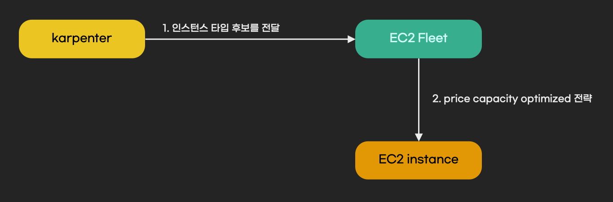
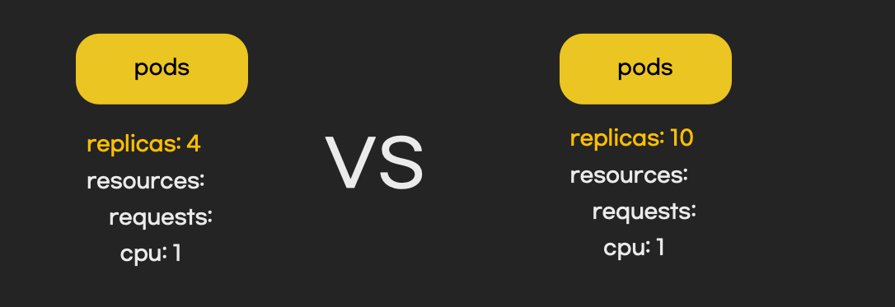

## 개요
이 문서는 karpenter에서 인스턴스 타입 후보를 결정하는 기준을 설명합니다. 이 글은 유투브 영상으로도 만나 볼 수 있습니다. 아래 이미지를 클릭하면 유튜부 영상으로 이동합니다.

## 선정 기준
EKS환경에서 karpenter는 EC2 fleet이 인스턴스 타입을 잘 결정할 수 있도록 인스턴스 타입 후보를 전달합니다. EC2 fleet은 전달받은 인스턴스 타입 중에 적절한 타입을 선택하고 EKS노드를 생성합니다.

karpenter가 EC2 인스턴스 후보를 결정하는 기준은 아래와 같습니다.

1. pending pod의 resources.request 합
1. VPC CNI 등 daemonset을 실행할 여유 리소스 계산
1. NodePool에 정의한 인스턴스 옵션을 고려하여 인스턴스 후보 선택

예를 들어 아래 그림 처럼 2개 pod가 있으면, 인스턴스 후보의 cpu는 3코어를 초과해야 합니다. 그리고 NodePool에 정의한 인스턴스 옵션을 고려하여 최종 인스턴스 후보를 결정합니다.

## 주의사항
pending pod에 resource.request가 정의되어 있지 않으면, requests 합이 0으로 계산됩니다. 따라서 사양이 낮은 인스턴스 타입 후보들이 선택될 확률이 높습니다.

