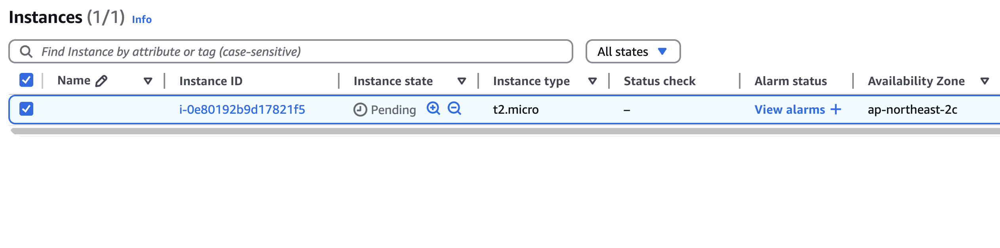
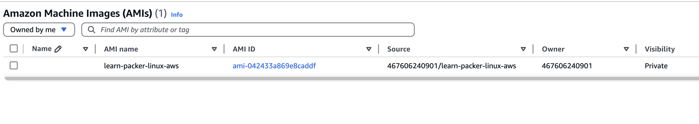

## 개요
* packer tutorial 실습

## 실습

1. packer 초기화

```sh
packer init .
```

2. pakcer build 실행

```sh
$ packer build aws-ubuntu.pkr.hcl
learn-packer.amazon-ebs.ubuntu: output will be in this color.

==> learn-packer.amazon-ebs.ubuntu: Prevalidating any provided VPC information
==> learn-packer.amazon-ebs.ubuntu: Prevalidating AMI Name: learn-packer-linux-aws
    learn-packer.amazon-ebs.ubuntu: Found Image ID: ami-086c6008c98cc0aad
==> learn-packer.amazon-ebs.ubuntu: Creating temporary keypair: packer_676bc54d-fdcd-d48a-60ac-abd57ed413f5
==> learn-packer.amazon-ebs.ubuntu: Creating temporary security group for this instance: packer_676bc54e-fbe0-7ca5-6fb9-ad87de440a60
==> learn-packer.amazon-ebs.ubuntu: Authorizing access to port 22 from [0.0.0.0/0] in the temporary security groups...
==> learn-packer.amazon-ebs.ubuntu: Launching a source AWS instance...
    learn-packer.amazon-ebs.ubuntu: Instance ID: i-0e80192b9d17821f5
==> learn-packer.amazon-ebs.ubuntu: Waiting for instance (i-0e80192b9d17821f5) to become ready...
==> learn-packer.amazon-ebs.ubuntu: Using SSH communicator to connect: 13.125.221.210
==> learn-packer.amazon-ebs.ubuntu: Waiting for SSH to become available...
==> learn-packer.amazon-ebs.ubuntu: Connected to SSH!
==> learn-packer.amazon-ebs.ubuntu: Stopping the source instance...
    learn-packer.amazon-ebs.ubuntu: Stopping instance
==> learn-packer.amazon-ebs.ubuntu: Waiting for the instance to stop...
==> learn-packer.amazon-ebs.ubuntu: Creating AMI learn-packer-linux-aws from instance i-0e80192b9d17821f5
    learn-packer.amazon-ebs.ubuntu: AMI: ami-042433a869e8caddf
==> learn-packer.amazon-ebs.ubuntu: Waiting for AMI to become ready...
==> learn-packer.amazon-ebs.ubuntu: Skipping Enable AMI deprecation...
==> learn-packer.amazon-ebs.ubuntu: Skipping Enable AMI deregistration protection...
==> learn-packer.amazon-ebs.ubuntu: Terminating the source AWS instance...
==> learn-packer.amazon-ebs.ubuntu: Cleaning up any extra volumes...
==> learn-packer.amazon-ebs.ubuntu: No volumes to clean up, skipping
==> learn-packer.amazon-ebs.ubuntu: Deleting temporary security group...
==> learn-packer.amazon-ebs.ubuntu: Deleting temporary keypair...
Build 'learn-packer.amazon-ebs.ubuntu' finished after 2 minutes 43 seconds.
```

* 3. EC2 인스턴스 실행 확인: packer가 AMI를 생성하기 위해 임시 EC2인스턴스를 생성함



* 4. packer가 생성한 AMI 생성 확인



## 참고자료
* https://developer.hashicorp.com/packer/tutorials/aws-get-started/aws-get-started-build-image
