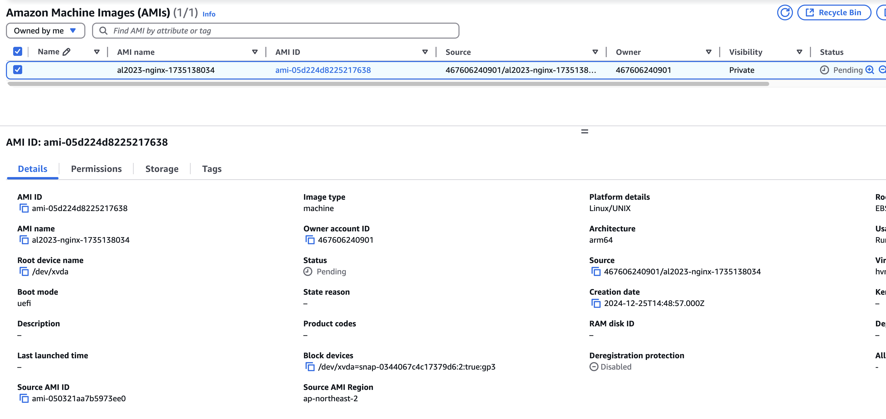

## 개요
* packer를 codebuild로 실행

## 실습 예제

### buildspec.yaml

```yaml
version: 0.2

phases:
  install:
    commands:
    - echo Installing Packer...
    - sudo yum install -y yum-utils
    - sudo yum-config-manager --add-repo https://rpm.releases.hashicorp.com/AmazonLinux/hashicorp.repo
    - sudo yum -y install packer
  build:
    commands:
    - echo Starting Packer build...
    - packer init ./
    - packer build al2023-nginx.pkr.hcl
artifacts:
  files:
  - '**/*'
```

### al2023-nginx.pkr.hcl

```hcl
packer {
  required_plugins {
    amazon = {
      version = ">= 1.2.8"
      source  = "github.com/hashicorp/amazon"
    }
  }
}

source "amazon-ebs" "nginx" {
  ami_name      = "al2023-nginx-{{timestamp}}"
  instance_type = "t4g.medium"
  region        = "ap-northeast-2"

  source_ami_filter {
    filters = {
      name                = "al2023-ami-minimal-2023.6.*"
      root-device-type    = "ebs"
      virtualization-type = "hvm"
    }
    owners      = ["137112412989"] # Amazon
    most_recent = true
  }

  ssh_username = "ec2-user"
}

build {
  name = "nginx-golden-image"
  sources = [
    "source.amazon-ebs.nginx"
  ]
  provisioner "shell" {
    inline = [
      "sudo yum -y install nginx",
      "sudo systemctl enable nginx",
    ]
  }
}
```

### 테라폼으로 생성하는 codebuild

```hcl
terraform {
  required_providers {
    aws = {
      source  = "hashicorp/aws"
      version = "5.81.0"
    }
  }

  required_version = ">= 1.4"
}

provider "aws" {
  region = "ap-northeast-2"
}

resource "aws_codebuild_project" "example" {
  name          = "example-codebuild-project"
  description   = "Example CodeBuild project"
  build_timeout = 180

  environment {
    compute_type                = "BUILD_GENERAL1_SMALL"
    image                       = "aws/codebuild/amazonlinux-x86_64-standard:5.0-23.05.22"
    type                        = "LINUX_CONTAINER"
    image_pull_credentials_type = "CODEBUILD"
  }

  service_role = aws_iam_role.codebuild_role.arn

  source {
    type            = "GITHUB"
    location        = "https://github.com/choisungwook/portfolio"
    git_clone_depth = 1
    buildspec       = "packer/3_packer_with_codebuild/codebuild/buildspec.yaml"
  }

  # reference: https://github.com/choisungwook/portfolio/pull/135
  source_version = "613e58245f9ce62a7f50653ceb8d8207d05ee032"

  artifacts {
    type = "NO_ARTIFACTS"
  }

  tags = {
    Environment = "test"
  }
}

resource "aws_iam_role" "codebuild_role" {
  name = "codebuild-role"

  assume_role_policy = jsonencode({
    Version = "2012-10-17"
    Statement = [
      {
        Action = "sts:AssumeRole"
        Effect = "Allow"
        Principal = {
          Service = "codebuild.amazonaws.com"
        }
      }
    ]
  })

  tags = {
    Environment = "test"
  }
}

resource "aws_iam_role_policy" "codebuild_policy" {
  name = "codebuild-policy"
  role = aws_iam_role.codebuild_role.id

  policy = jsonencode({
    Version = "2012-10-17"
    Statement = [
      {
        Action = [
          "s3:GetObject",
          "s3:PutObject"
        ]
        Effect   = "Allow"
        Resource = "*"
      },
      {
        Action = [
          "ec2:AttachVolume",
          "ec2:AuthorizeSecurityGroupIngress",
          "ec2:CopyImage",
          "ec2:CreateImage",
          "ec2:CreateKeypair",
          "ec2:CreateSecurityGroup",
          "ec2:CreateSnapshot",
          "ec2:CreateTags",
          "ec2:CreateVolume",
          "ec2:DeleteKeyPair",
          "ec2:DeleteSecurityGroup",
          "ec2:DeleteSnapshot",
          "ec2:DeleteVolume",
          "ec2:DeregisterImage",
          "ec2:DescribeImageAttribute",
          "ec2:DescribeImages",
          "ec2:DescribeInstances",
          "ec2:DescribeInstanceStatus",
          "ec2:DescribeRegions",
          "ec2:DescribeSecurityGroups",
          "ec2:DescribeSnapshots",
          "ec2:DescribeSubnets",
          "ec2:DescribeTags",
          "ec2:DescribeVolumes",
          "ec2:DetachVolume",
          "ec2:GetPasswordData",
          "ec2:ModifyImageAttribute",
          "ec2:ModifyInstanceAttribute",
          "ec2:ModifySnapshotAttribute",
          "ec2:RegisterImage",
          "ec2:RunInstances",
          "ec2:StopInstances",
          "ec2:TerminateInstances"
        ]
        Effect   = "Allow"
        Resource = "*"
      }
    ]
  })
}
```

### codebuild_build.sh

* [codebuild github](https://github.com/aws/aws-codebuild-docker-images/blob/master/local_builds/codebuild_build.sh)에서 다운로드 하세요

## 로컬 실행
* $HOME/.aws/config파일에 설정된 default 프로파일로 codebuild를 로컬로 실행합니다. 아래 예제는 ARM 맥북(aarch64)에서 실행한 예제입니다.

```sh
./codebuild_build.sh \
  -i public.ecr.aws/codebuild/amazonlinux2-aarch64-standard:3.0 \
  -l public.ecr.aws/codebuild/local-builds:aarch64 \
  -c \
  -p default \
  -b buildspec-local.yaml \
  -a artifacts
```

* ARM 맥북에서 실행하려면 [packer 설정](./al2023-nginx.pkr.hcl)에서 인스턴스타입을 graviton으로 변경해야 합니다.

```hcl
source "amazon-ebs" "nginx" {
  ami_name      = "al2023-nginx-{{timestamp}}"
  instance_type = "t4g.medium" # <-- change
```

* AWS console에서 생성된 AMI를 확인합니다.



## codebuild 실행

1. terraform으로 codebuild를 생성합니다.

```sh
terraform init
terraform apply
```

2. codebuild를 실행하고 실행결과가 성공했는지 확인합니다.


3. AMI가 생성되었는지 확인합니다.

## 참고자료
* https://github.com/aws/aws-codebuild-docker-images/blob/master/local_builds/codebuild_build.sh
