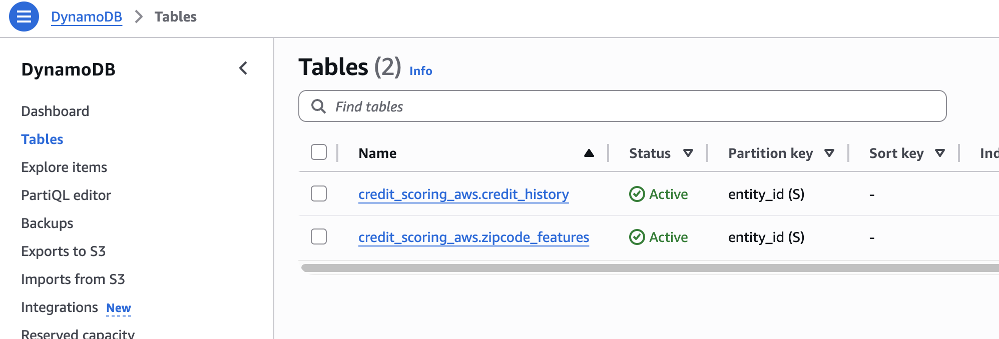

# 개요

* 이 예제는 [feast의 공식예제](https://github.com/feast-dev/feast-aws-credit-scoring-tutorial)로 AWS 인프라에서 feast를 사용하는 예제입니다.
* 저는 Redshift를 postgres docker container로 변경했고 ElasticCache를 valkey(redis) docker container로 변경했습니다.

## 1. 예제 목표

* 실시간으로 "사용자 A에 대한 대출 승인 여부를 예측해줘" 라는 요청
* 실시간이라는 의미는 API등으로 사용자가 요청하면 바로 응답하는 것을 말합니다.

## 2. 예제 설명

* AI는 대출 신청자의 신용평가를 하여 대출 신청을 승인하거나 거부합니다. 신용평가란 고객 정보를 활용하여 대출금 상환 또는 연체 가능성을 판단합니다.
* 고객의 정보가 feature입니다.
* feature store는 postgres, dynamodb를 사용합니다.

## 3. 아키텍처

* Postgres 역할:
  * feature store의 offline store
  * 대용량 historical data 저장
  * Training dataset 생성을 위한 point-in-time correct join 수행
  * Batch feature 생성
* DynamoDB 역할:
  * feature store의 online store
  * 실시간 inference를 위한 최신 feature 값 저장 (low-latency access)
  * 각 entity의 최신 feature만 저장 (point lookup)
  * millisecond 수준의 응답 시간 제공


## 4. 필요조건

* Python >= 3.12
* uv

## 5. 실습준비

1. python 가상환경 생성

```sh
uv venv --python 3.12
source ./.venv/bin/activate
```

2. python 패키지 설치

```sh
uv sync
```

## 6. 실습

### 6.1 feature 등록

* feast apply 실행하면 online store, offline store
  * 메타데이터 저장: Feature Store의 메타데이터(entities, feature views 정의)가 `registry.db` 파일에 저장됩니다.
  * DynamoDB 테이블 생성:
    * credit_scoring_aws_credit_history 테이블 생성
    * credit_scoring_aws_zipcode_features 테이블 생성

```sh
$ cd feature-repo
$ feast apply
Registered entity dob_ssn
Registered entity zipcode
Registered feature view credit_history
Registered feature view zipcode_features
Deploying infrastructure for credit_history
Deploying infrastructure for zipcode_features
```



```sh
$ cd feature-repo
$ feast entities list
$ feast feature-views list
```

### 6.2 offline store -> online store 동기화

```sh
$ cd feature-repo
$ CURRENT_TIME=$(date -u +"%Y-%m-%dT%H:%M:%S")
$ feast materialize-incremental $CURRENT_TIME
```

## Train

Finally, we train the model using a combination of loan data from S3 and our zipcode and credit history features from Redshift
(which in turn queries S3), and then we test online inference by reading those same features from DynamoDB

```
python run.py
```
The script should then output the result of a single loan application
```
loan rejected!
```

## Interactive demo (using Streamlit)

Once the credit scoring model has been trained it can be used for interactive loan applications using Streamlit:

Simply start the Streamlit application
```
streamlit run streamlit_app.py
```
Then navigate to the URL on which Streamlit is being served. You should see a user interface through which loan applications can be made:


## 참고자료

* https://github.com/feast-dev/feast-aws-credit-scoring-tutorial
* https://aws.amazon.com/ko/blogs/database/build-an-ultra-low-latency-online-feature-store-for-real-time-inferencing-using-amazon-elasticache-for-redis/
