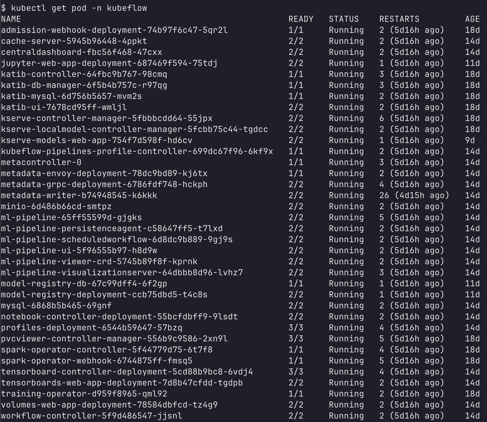

# 개요

* kubeflow dashboard에 대해 설명합니다.

## kubeflow dashboard란?

* kubeflow dashboard는 kubeflow의 수많은 컴퍼넌트를 단 하나의 웹페이지에서 접근하게 합니다. kubeflow pod는 아래 그림처럼 엄청 많은 컴퍼넌트가 있는데, 이 컴퍼넌트를 단 하나의 웹페이지에서 접근할 수 있습니다.



## 대시보드 접속 방법

* kubeflow ingress가 설치되어 있지 않다면, port-foward로 접속하세요.
* port-forward로 접속하면 일부 컴퍼넌트 접속이 원할하지 않습니다.

> 크롬 브라우저를 사용하면 비율이 깨질 수 있습니다.

```sh
kubectl port-forward svc/istio-ingressgateway -n istio-system 8888:80
```

## 예제 ID/PW

* kubeflow example에는 기본 계정을 제공합니다.

```sh
ID: user@example.com
PW: 12341234
```

## 다음에 할 작업

* [notebooks](../notebook/)
