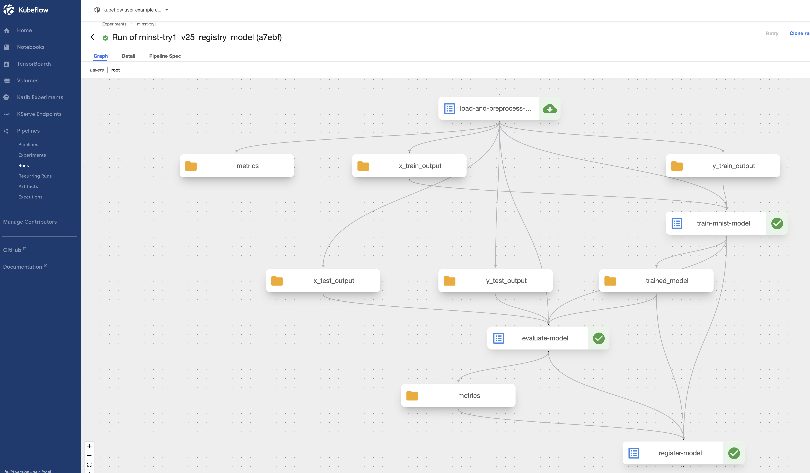

# 개요

* kubeflow pipeline과 serving예제
* 예제
  1. mnifst를 판별하는 sicket-learn AI모델을 생성하고 model registry에 업로드
  2. model registry를 한개 선택해서 서빙



## kubeflow IR yaml파일 만드는 방법

```sh
cd pipelines/sklearn
python pipeline.py
```

## model registry에 모델 정보를 조회하는 방법

* Macbook을 사용하면 kubeflow model registry UI pod를 실행하지 못함(ARM 미지원)
* 그러므로, model registry pod 쉘에서 모델을 조회

1. model registry에 접근하기 위해, istio-ingressgateway를 port-forward

```sh
kubectl port-forward svc/istio-ingressgateway -n istio-system 8080:80
```

2. model regitsry pod에서 마지막에 업로드된 모델 정보를 조회

```sh
cd serving
get-latest-model.sh
```

## 서빙 예제

* [서빙 문서 바로가기](./serving/)

## 참고자료

* https://www.kubeflow.org/docs/components/model-registry/getting-started
* [akbun tensorflow ARM dockerfile](../../../dockerfiles/tensorflow/)
* https://medium.com/@gabi.preda/building-machine-learning-pipelines-with-vertex-ai-and-kubeflow-in-gcp-2214442ba62d
* https://medium.com/@lorenzo.colombi/kubeflow-pipeline-v2-tutorial-end-to-end-mnist-classifier-example-dc66714c2649
* https://blog.kubeflow.org/fraud-detection-e2e/
* https://docs.kakaocloud.com/en/tutorial/machine-learning-ai/traffic-prediction-model-serving
* kubeflow model registry API: https://www.kubeflow.org/docs/components/model-registry/reference/rest-api/
