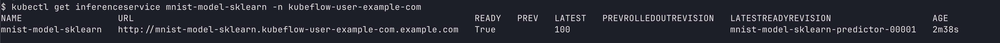
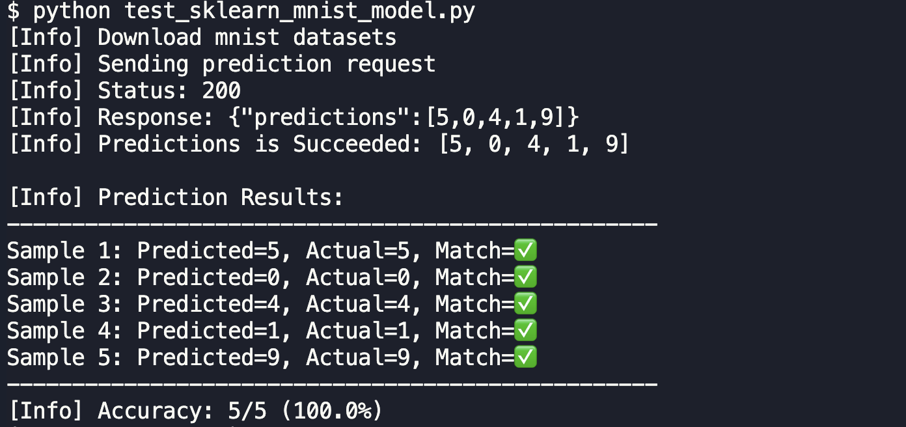

# 개요

* [sklearn kserve](../sklearn/InferenceService.yaml)를 배포한 후 테스트 하는 방법을 정리

## 테스트 방법

1.InferenceService 상태 확인

```sh
kubectl get inferenceservice mnist-model-sklearn -n kubeflow-user-example-com
```



2. 서빙 URL확인

* (옵션 1) istio를 사용하고 있다면 아래 명령어로 URL을 조회하세요

kubectl get inferenceservice mnist-model-sklearn -n kubeflow-user-example-com -o jsonpath='{.status.url}'

* (옵션 2) istio를 사용안하고 있다면 kubernetes service가 생성되었는지 확인하세요.

```sh
kubectl -n kubeflow-user-example-com get svc
```

3. 포트포워딩

* (옵션 2) istio를 사용안하고 있다면, 아래 명령어로 port-foward를 합니다.

```sh
kubectl port-forward -n kubeflow-user-example-com svc/mnist-model-sklearn-predictor-00001 8080:80
```

2. 포트포워딩으로 테스트:

```sh
# 포트포워딩 (istio-system namespace의 istio-ingressgateway 사용)
kubectl port-forward -n istio-system svc/istio-ingressgateway 8080:80
```

```sh
# 또는 직접 서비스 포트포워딩
kubectl port-forward -n kubeflow-user-example-com svc/mnist-model-sklearn-predictor-default 8080:80
```

5. 모델조회

```sh
$ curl http://127.0.0.1:8090/v1/models/mnist-model-sklearn
{"name":"mnist-model-sklearn","versions":null,"platform":"","inputs":[],"outputs":[]}
```

6. 추론 테스트

* 추론을 하기 위해 모델이 직접 추론하도록 API를 호출합니다.

```sh
curl -X POST http://localhost:8080/v1/models/mnist-model-sklearn:predict \
  -H "Content-Type: application/json" \
  -d '{"instances": [[0.0, 0.0, 0.0, ... 784개 값 ...]]}'
```

* 저는 python으로 API를 호출하고, 추론결과와 진짜 정답을 비교했습니다.

```sh
python test_sklearn_mnist_model.py
```


