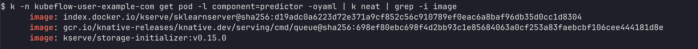

## pod에 마운트된 AI모델 확인

```sh
$ kubectl exec mnist-model-predictor-00001-deployment-86f84c55f9-dtjnl -n kubeflow-user-example-com
-c kserve-container -- ls /mnt/models/
fingerprint.pb	saved_model.pb	variables
```

## predictor pod error

```sh
queue-proxy aggressive probe error (failed 190 times): dial tcp 127.0.0.1:8080: connect: connection refused
│ queue-proxy context deadline exceeded
```

```sh
$ ps -ef
00:02:25 /usr/bin/tensorflow_model_server --model_name=mnist-model --port=9000 --rest_api_port=8080 --model_base_path=/mnt/models
```

## kubeflow API를 호출하는 방법

```sh
$ kubectl exec -it -n kubeflow deployment/model-registry-deployment -- curl -s http://localhost:8080/api/model_registry/v1alpha3/registered_models

"items": [
{
  "author": "akbun",
  "createTimeSinceEpoch": "1755441545734",
  "customProperties": {},
  "description": "MINST model description",
  "id": "5",
  "lastUpdateTimeSinceEpoch": "1755441545734",
  "name": "c0c8c5",
  "registeredModelId": "4",
  "state": "LIVE"
},
"nextPageToken": "",
"pageSize": 0,
"size": 3
```

```sh
$ kubectl exec -n kubeflow deployment/model-registry-deployment -- curl -s http://localhost:8080/api/model_registry/v1alpha3/model_versions/7/artifacts
{
  "items": [
    {
      "artifactType": "model-artifact",
      "createTimeSinceEpoch": "1755623393020",
      "customProperties": {},
      "id": "5",
      "lastUpdateTimeSinceEpoch": "1755623393020",
      "modelFormatName": "tensorflow",
      "modelFormatVersion": "2.20.0",
      "name": "mnist",
      "state": "UNKNOWN",
      "uri": "/minio/mlpipeline/v2/artifacts/mnist-pipeline/a022ae87-f389-48b8-b3fc-b770e8ef48e5/train-mnist-model/18ef735e-67ce-467e-b98b-1ccd61d6bf29/trained_model/1755623161/output_model"
    }
  ],
  "nextPageToken": "",
  "pageSize": 0,
  "size": 1
}
```

## kubeflow API의 단점

* KServe can't directly download from the Model Registry API endpoint. Instead, we need to use the actual storage URI(ex: minio).


## KServe 서빙 이미지 버전 확인



```sh
kubectl -n kubeflow-user-example-com get pod -l component=predictor -oyaml | k neat | grep -i image
```

```sh
kubectl run temp-sklearn --image=kserve/sklearnserver:latest --rm -it --restart=Never -- python -c "import
  sklearn; print(sklearn.__version__)"
```
