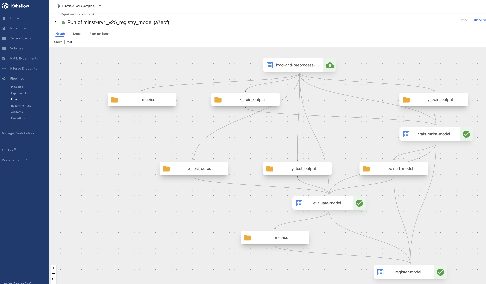

# 개요

* kubeflow pipeline



## kubeflow IR yaml파일 만드는 방법

```sh
python kubeflow_pipeline.py
```

## model registry에 모델 정보를 가져오는 방법

* model reistry SDK를 사용하여 모델 정보를 가져와야 함
* kubernetes job으로 python script 실행

```sh
kubectl apply -f get_models_from_modelregistry.yaml
```

```sh
$ kubectl -n kubeflow-user-example-com logs -f get-mnist-model-v4r52
name='c0c8c5' id='5' description='MINST model description' external_id=None create_time_since_epoch='1755441545734' last_update_time_since_epoch='1755441545734' custom_properties=None author='akbun' state=<ModelVersionState.LIVE: 'LIVE'> registered_model_id='4'
```

## 참고자료

* https://www.kubeflow.org/docs/components/model-registry/getting-started
* [akbun tensorflow ARM dockerfile](../../../dockerfiles/tensorflow/)
* https://medium.com/@gabi.preda/building-machine-learning-pipelines-with-vertex-ai-and-kubeflow-in-gcp-2214442ba62d
* https://medium.com/@lorenzo.colombi/kubeflow-pipeline-v2-tutorial-end-to-end-mnist-classifier-example-dc66714c2649
* https://blog.kubeflow.org/fraud-detection-e2e/
* https://docs.kakaocloud.com/en/tutorial/machine-learning-ai/traffic-prediction-model-serving
