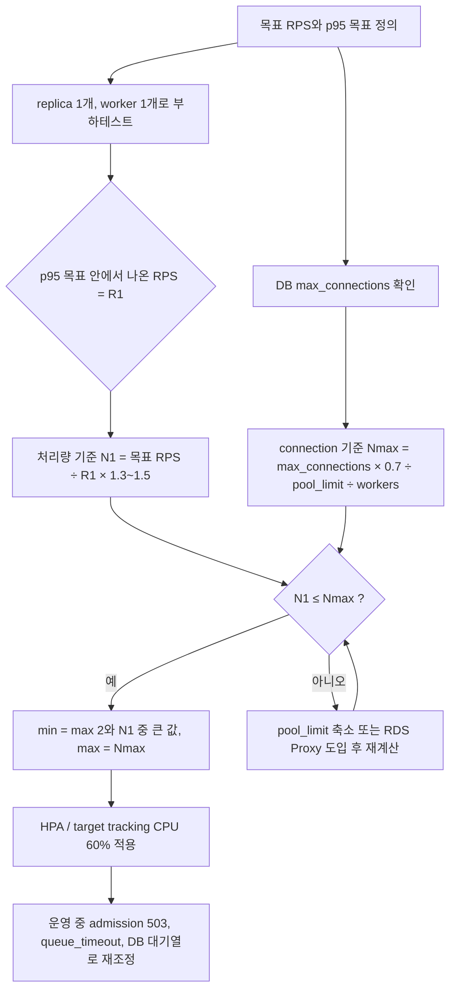
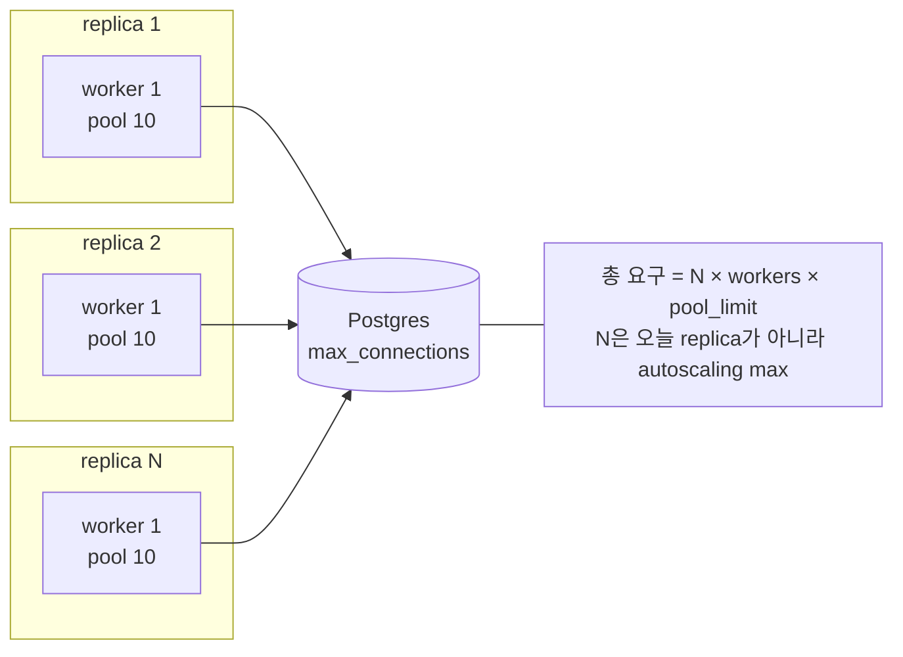
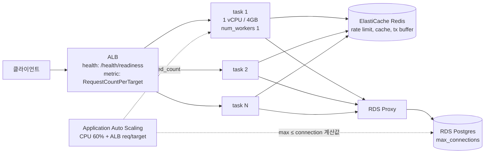

# LiteLLM Proxy replica 개수 산정 기준과 벤치마크 정리

ECS 배포를 전제로 정리. Kubernetes 사례는 컨테이너 단위 원칙이 같아 함께 실음. 조사일: 2026-09-10.

## 결론

replica 개수는 아래 3개 상한/하한의 교집합으로 정함.

| 기준 | 계산 | 결정하는 값 |
| --- | --- | --- |
| 1. 처리량 | 목표 RPS ÷ replica 1개 실측 RPS × 여유(1.3~1.5) | 평상시 desired / HPA min 근처 |
| 2. DB connection | DB max_connections ÷ (worker 수 × pool_limit) | autoscaling max 상한 |
| 3. 가용성 | 최소 2 (AZ 분산, 무중단 배포) | 절대 하한 |

- 공식 벤치마크 기준값: 4 vCPU / 8GB 인스턴스 4대(worker = CPU 수)로 약 1,170 RPS, p95 150ms, LiteLLM 자체 overhead p95 8ms
- 위 수치는 fake OpenAI endpoint + Postgres 있음 + Redis 없음 + 로깅 콜백 없음 조건. 실제 서비스 조건(spend log, guardrail, callback)에서는 커뮤니티 경험상 worker당 20~50 RPS까지 내려간다는 보고 있음. 그래서 replica 산정은 반드시 내 config로 실측한 replica당 RPS를 써야 함
- 컨테이너 환경(Kubernetes, ECS) 공식 권고: 컨테이너 1개 = worker 1개, 1 vCPU / 4Gi, CPU 60% 기준으로 수평 확장. memory는 scaling 신호로 쓰지 않음
- ECS 기준 권장 시작점: task 1 vCPU / 4GB, min 2, target tracking CPU 60% + ALBRequestCountPerTarget, max는 DB connection 계산값 이하

## 산정 절차

산정 흐름을 순서대로 표현한 그림.



## 기준 1. 처리량: 공식 벤치마크가 무엇을 쟀는가

### 테스트 조건

| 항목 | 값 |
| --- | --- |
| 인스턴스 | 4 CPU / 8GB, worker 수 = CPU 수 |
| 대상 | fake OpenAI endpoint (BerriAI/example_openai_endpoint) |
| DB | PostgreSQL 사용 (virtual key, spend 기록 경로 포함) |
| Redis | 미사용 |
| 로깅 콜백 | 없음 (GCS, LangSmith 별도 비교) |
| 부하 도구 | Locust 1,000 users, ramp-up 500, think time 0.5~1초 |
| 실제 in-flight | 약 130 요청 (think time 때문에 1,000이 아님) |
| 측정 | /chat/completions, 응답 헤더 x-litellm-overhead-duration-ms로 gateway 자체 overhead 분리 |

### 결과

| 구성 | RPS | median | p95 | p99 | overhead median / p95 |
| --- | --- | --- | --- | --- | --- |
| 2 instances | 1,035 | 200ms | 630ms | 1,200ms | 12ms / 29ms |
| 4 instances | 1,170 | 100ms | 150ms | 240ms | 2ms / 8ms |

- 2대에서 4대로 늘려도 RPS는 거의 그대로(부하 생성기 상한). 대신 p95가 630ms에서 150ms로 4배 개선. 즉 replica 추가는 처리량보다 지연 꼬리를 먼저 줄임
- 4대 조건에서 순수 overhead는 p95 8ms. 나머지 지연은 대기열
- 로깅 콜백 영향: GCS bucket 1,133 vs 1,137 RPS, LangSmith 1,133 vs 1,135 RPS로 차이 없음 (비동기 콜백)
- Portkey v1.14.0 비교: 같은 4대 조건에서 RPS 동일(1,170), LiteLLM p99 240ms vs Portkey 500ms. 단 LiteLLM 쪽이 DB 포함, Portkey는 DB 없음

### 재현 시 주의

- 벤치마크 문서가 명시: 같은 RPS라도 in-flight 수가 8배면 Little's Law로 지연도 8배. think time 없는 closed-loop 부하는 다른 수치를 냄. 비교하려면 in-flight 약 130을 맞추거나 RPS와 in-flight를 함께 보고
- 1K RPS 튜토리얼에서 사용한 proxy 머신은 t2.large(2 vCPU / 8GB) × 4 replica. 부하기는 2 vCPU 1대에 locust --processes 4

### 커뮤니티가 말하는 현실 값

| 출처 | 조건 | replica(worker) 1개당 RPS |
| --- | --- | --- |
| Discussion #33980 (비공식 답변) | DB, callback 없음 | 100~250 |
| Discussion #33980 (비공식 답변) | Postgres + logging + callback | 20~50 |
| Performance roadmap #15933 (maintainer, 2025-10) | v1.78.5, 4대 × 4 vCPU/8GB, Postgres, Redis 없음, 1K RPS | overhead median 8ms / p99 45ms, worker 1개 시작 시 약 500MB (Prisma 약 200MB) |
| Rust gateway 벤치마크 (vendor-run, 2026-07) | 단일 호스트, mock upstream, DB/로깅 없음 | Python v1 p99 overhead 257.7ms, peak 329.5MB. Rust beta는 0.7ms / 21.8MB |

- 공식 4대 벤치마크는 대당 약 290 RPS. 커뮤니티 하한(20~50)과 6~10배 차이. 차이는 spend log 동기 쓰기, guardrail, 동기 콜백에서 나옴
- 그래서 "replica 몇 개"의 유일한 신뢰 가능한 입력은 내 config로 잰 R1

### 계산 예시

- 목표 300 RPS, 내 config로 1 worker task 실측 80 RPS(p95 안)
- N1 = 300 ÷ 80 × 1.3 = 4.9 → 5
- HA 하한 2 → min 2, 평상시 5, 피크 대비 max는 기준 2로 결정

## 기준 2. DB connection 상한이 max replica를 정함

connection 수가 replica × worker × pool로 곱해지는 구조.



- 공식 공식: database_connection_pool_limit = MAX_DB_CONNECTIONS ÷ (instances × workers). 기본 10, 권장 10~20
- 가장 흔한 장애는 DB CPU가 아니라 FATAL: sorry, too many clients already
- litellm-helm 기본 maxReplicas 100 × pool 10 = 1,000 connection 요구. 기본 Postgres가 못 받음
- RDS 기본 max_connections = LEAST(메모리/9531392, 5000). 8GB 약 860, 32GB 약 3,600
- 예시: db.m7g.large(8GB, 약 860) → 마이그레이션, UI, 다른 클라이언트 몫 30% 남기고 600 ÷ (1 worker × 10) = max replica 60
- connection이 부족하면 RDS Proxy 앞에 두고 database_disable_prepared_statements: true
- 약 1,000 RPS 또는 10 instance 이상이면 use_redis_transaction_buffer: true로 spend 쓰기를 Redis에 모아 한 인스턴스가 flush. 그렇지 않으면 같은 key/team row에 UPDATE가 몰려 deadlock

DB 크기 권고(공식 db_sizing).

| 지속 RPS | DB vCPU / RAM | 필요 connection | AWS 예시 |
| --- | --- | --- | --- |
| ~1K | 4 / 16GB | 100~200 | db.m7g.large |
| 1K~5K | 8 / 32GB | 200~500 | db.m7g.xlarge |
| 5K+ | 16+ / 64GB | 500+ 와 read replica | db.m7g.2xlarge + Aurora reader |

## 기준 3. 메모리와 가용성

- 4Gi는 목표가 아니라 바닥. Prisma query engine 메모리는 지금까지 실행한 가장 큰 statement 크기의 high-water mark로 올라가고 내려오지 않음. 4Gi 미만이면 큰 spend log 1건에 OOM kill
- 그래서 memory utilization은 scaling 신호로 부적합. 한 번 큰 쓰기 후 replica가 늘고 다시 안 줄어듦. 공식 권고는 CPU 60%만 사용
- 60%인 이유: startup probe가 최대 300초. 80%에서 확장하면 새 replica가 포화 몇 분 뒤에 도착
- replica 2개 이상이면 Redis 필수. 없으면 rate limit, budget, cooldown이 replica마다 따로 카운트되어 key당 한도가 replica 수만큼 곱해짐
- 메모리가 서서히 늘면 --max_requests_before_restart 10000 과 jitter로 worker 재활용
- worker 수를 늘리면 background job(spend flush, budget reset 등)도 worker 수만큼 복제 실행. 큰 배포는 LITELLM_JOB_ROLE=worker 전용 replica 1개를 따로 두고 serving replica는 serving 역할만

## Kubernetes 사례

| 사례 | replica | pod 자원 | worker | autoscaling | 비고 |
| --- | --- | --- | --- | --- | --- |
| 공식 prod 권고 | HPA | 1 vCPU / 4Gi (req = limit) | 1 | CPU 60%, memory 미설정 | 컨테이너당 1 worker, 수평 확장 |
| litellm-helm 기본값 | 1~100 | 미지정 | 1 | CPU 80%, 기본 off | 설치 편의용. prod에서 max와 threshold 낮춰야 함 |
| componentized chart (gateway) | 1~10 | 미지정 | 1 | CPU 70%, memory 80% | backend max 4, ui max 3 |
| aws-samples litellm-bedrock-gateway-on-eks | 2 고정 | req 250m/1Gi, limit 500m/2Gi | 미지정 | HPA 없음 | 2개 이유는 HA와 rolling update. 공식 4Gi 바닥보다 낮아 큰 spend log 시 OOM 위험 |
| 공식 prod 예시 manifest | serving 10 + worker 1 | 1 vCPU / 4Gi | 1 | HPA | LITELLM_JOB_ROLE 분리 |

- nproc 함정(Issue #26620): 문서가 --num_workers $(nproc)를 권했지만 pod 안 nproc은 노드 CPU 수를 반환. Downward API로 requests.cpu를 CPU_REQUEST env로 넣거나 1로 고정. 이슈는 not planned로 닫힘

Downward API로 worker 수를 pod 요청값에 맞추는 snippet.

```yaml
env:
  - name: CPU_REQUEST
    valueFrom:
      resourceFieldRef:
        resource: requests.cpu
args: ["--config", "/app/config.yaml", "--num_workers", "$(CPU_REQUEST)"]
```

- 무중단 rolling: maxUnavailable 0, maxSurge 1, readiness /health/readiness, terminationGracePeriodSeconds 620(request_timeout 600 초과), preStop sleep 5
- admission control: general_settings.max_in_flight_requests_per_worker 64 설정 시 worker가 포화되면 503 + retry-after 반환. HPA가 새 replica를 띄우는 동안 기존 replica가 지연을 쌓지 않고 shed. queue_timeout 503이 지속되면 replica 부족 신호
- Issue #8444: LiteLLM config에 k8s Service 이름을 넣으면 같은 pod로만 간다는 보고(v1.57.8). 원인은 이슈에 확정되지 않음. upstream(vLLM 등) replica 분산이 필요하면 model_list에 pod별 deployment를 나열하거나 L7 LB 뒤에 두는 편이 안전

## ECS 사례

| 사례 | task 크기 | desired / min / max | worker | autoscaling | 비고 |
| --- | --- | --- | --- | --- | --- |
| aws-samples sample-claude-code-with-litellm-and-bedrock (CDK/Terraform) | Fargate 1 vCPU / 2GB | 2 / 2 / 10 | 미지정 | target tracking CPU 60%, memory 70%, ALB 50 req/min/target, scale-out 60s, scale-in 120s | 데모 비용 우선. RDS single-AZ, Redis 없음 |
| BerriAI terraform module (BerriAI/litellm/aws ~1.90) | 변수 | gateway 2 → max 10 | gateway_num_workers | 활성 | Aurora writer+reader, ElastiCache multi-AZ. Redis 끄면 per-key limit이 task 수만큼 곱해진다고 plan에서 경고 |
| BerriAI/litellm-ecs-deployment | taskdefinition.tf | desired_count 변수 | cpu = num_workers 원칙 | 없음 | CPU를 늘리면 memory 고정값 두지 말 것 |

- aws-samples 기본값 그대로 쓰면 안 되는 이유
  - task 2GB는 공식 4Gi 바닥 미만
  - memory 70% target tracking은 high-water mark 특성 때문에 scale-in이 안 됨. CPU와 ALBRequestCountPerTarget만 남기는 편이 공식 권고와 맞음
  - Redis 없이 min 2이면 rate limit이 2배로 새어나감
- ECS에 매핑한 공식 권고

| Kubernetes 개념 | ECS 대응 | 권장값 |
| --- | --- | --- |
| pod 1 worker | task 1개 = --num_workers 1 | task cpu 1024 / memory 4096 |
| HPA CPU 60% | Application Auto Scaling target tracking ECSServiceAverageCPUUtilization | 60 |
| HPA 요청 기반 | ALBRequestCountPerTarget | 실측 R1 × 60 × 0.7 (분당) |
| memory target | 설정 안 함 | - |
| readiness probe | ALB target group health check /health/readiness | interval 10s |
| terminationGracePeriodSeconds | stopTimeout(최대 120s) + target group deregistration_delay | 스트리밍 긴 요청은 request_timeout을 120s 이하로 맞추거나 EC2 launch type |
| maxUnavailable 0 | deployment minimumHealthyPercent 100, maximumPercent 200 | - |
| preStop sleep | deregistration_delay 5~30s | - |
| nproc 함정 | 없음. task cpu가 곧 컨테이너 상한 | num_workers = task cpu ÷ 1024 |

- ECS는 Fargate stopTimeout 상한이 120초. request_timeout 기본 600초라 긴 스트리밍 요청은 배포 시 끊길 수 있음. 이 점은 k8s(620초 설정 가능)와 다른 ECS 고유 제약

ECS 구성도.



## 이미지 생성 프롬프트

mermaid로 충분한 부분은 위에 그렸고, 발표 표지나 블로그 썸네일이 필요할 때만 아래를 사용.

- 프롬프트 1 (썸네일): "Flat vector illustration, isometric view. A row of identical small server containers labeled 'LiteLLM' behind a single load balancer, each container connected by a thin line to one large database cylinder. The lines converge into a bottleneck at the database, drawn in warning orange, while the containers are calm blue. Minimal, no text other than 'LiteLLM', white background, 16:9."
- 프롬프트 2 (개념도): "Clean infographic style diagram showing three gauges side by side labeled 'throughput', 'db connections', 'availability'. The overlapping safe zone of all three gauges is highlighted in green and labeled 'replica count'. Soft shadows, muted palette, no photorealism, 16:9."

## 참고 링크와 각 자료가 테스트한 것

| 링크 | 무엇을 테스트/기술했는가 |
| --- | --- |
| https://docs.litellm.ai/docs/benchmarks | 4 CPU/8GB × 2, 4 instance, fake OpenAI endpoint, Postgres, Redis 없음, Locust 1,000 users think 0.5~1s. RPS, p95, p99, overhead 헤더. GCS/LangSmith 콜백 영향, Portkey 비교 |
| https://docs.litellm.ai/docs/load_test_advanced | 1K RPS 재현 튜토리얼. t2.large × 4 replica, locustfile, rate limit 걸린 deployment 2개 분산 테스트(2 × 10K RPM) |
| https://docs.litellm.ai/docs/load_test | 100 users로 /health/readiness 응답시간 기초 테스트 |
| https://docs.litellm.ai/docs/proxy/prod | 1 vCPU/4Gi per worker, CPU 60% HPA, memory 신호 금지, pool 공식, transaction buffer, JOB_ROLE |
| https://docs.litellm.ai/docs/proxy/server_tuning | uvicorn vs gunicorn vs granian, worker 재활용, hitless rolling, admission control |
| https://docs.litellm.ai/docs/proxy/db_sizing | RPS별 DB 크기, 클라우드별 max_connections 기본식, RDS Proxy |
| https://docs.litellm.ai/docs/proxy/deploy | helm/componentized chart autoscaling 기본값, AWS ECS Fargate terraform module 설명 |
| https://docs.litellm.ai/docs/proxy/configs#configure-db-pool-limits--connection-timeouts | pool_limit 계산 공식과 예시 |
| https://docs.litellm.ai/blog/rust-ai-gateway-benchmarks | AIGatewayBench. 단일 호스트 mock upstream, DB/로깅 없음. Python v1 p99 overhead 257ms, 329MB. vendor-run |
| https://github.com/BerriAI/ai-gateway-bench | 위 벤치마크 재현 harness와 raw CSV |
| https://github.com/BerriAI/litellm/discussions/15933 | maintainer performance roadmap. v1.78.5 overhead 8ms/45ms at 1K RPS, worker 500MB 시작 메모리 |
| https://github.com/BerriAI/litellm/discussions/33980 | 단일 instance 예상 RPS 질문. 비공식 답변 100~250 vs 20~50 |
| https://github.com/BerriAI/litellm/issues/26620 | k8s에서 nproc이 노드 CPU를 반환하는 문서 결함. Downward API 대안 |
| https://github.com/BerriAI/litellm/issues/8444 | k8s Service 뒤 upstream replica로 분산 안 되는 문제 |
| https://github.com/BerriAI/litellm/pull/17388 | aiohttp connection pool 무한 누적 메모리 누수 수정. 기본 300 total / 50 per host |
| https://github.com/BerriAI/litellm/pull/26027 | granian 벤치마크. uvicorn 대비 10~20 RPS 개선 |
| https://github.com/aws-samples/sample-claude-code-with-litellm-and-bedrock | ECS Fargate 1 vCPU/2GB, 2~10 task, CPU 60 / mem 70 / ALB 50 req/min target tracking |
| https://github.com/BerriAI/litellm-ecs-deployment | ECS terraform, cpu = num_workers 원칙 |
| https://github.com/aws-samples/sample-litellm-bedrock-gateway-on-eks | EKS 2 replica 고정, 250m/1Gi ~ 500m/2Gi, HA 목적 |
| https://github.com/BerriAI/litellm/blob/main/.github/workflows/locustfile.py | 공식 부하테스트 locustfile |
| https://github.com/BerriAI/example_openai_endpoint | fake OpenAI endpoint 자체 호스팅 |

## 이번 조사에서 확인 못 한 것

- LiteLLM 공식 벤치마크는 전부 fake endpoint 기준. 실제 Bedrock/OpenAI 지연이 붙은 조건의 replica당 RPS 공식 수치 없음
- ECS Fargate에서 공식 부하테스트 수치 없음. 위 ECS 권장값은 k8s 권고를 매핑한 것
- 커뮤니티 20~50 RPS 수치는 재현 조건이 없어 참고값
