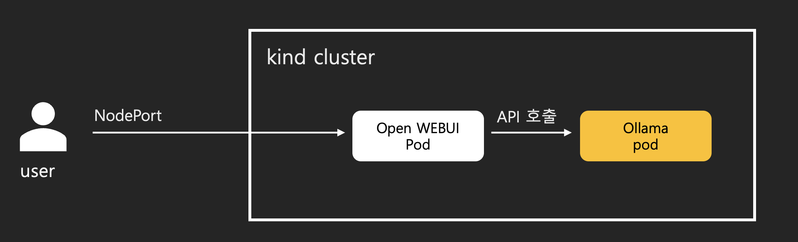

# 개요

* open webui와 ollama를 쿠버네티스에 구축합니다.
* 자세한 내용은 블로그와 유투브를 참조해주세요.

* 블로그: https://malwareanalysis.tistory.com/857
* 유투브: https://youtu.be/zmH1NWH8GbU

## 아키텍처

* open webui가 chatGPT와 유사한 UI/UX를 담당
* ollama가 inference server 역할을 담당
* 사용자가 open webui에 채팅으로 질문하면, open webui는 ollama API를 사용하여 사용자 요청을 전달, ollama는 AI를 실행하여 사용자 요청을 처리하고 open webui에 리턴, open webui는 리턴받은 값을 화면에 출력



## ollama

```sh
helm repo add otwld https://helm.otwld.com/
	helm upgrade --install ollama otwld/ollama \
		--namespace ollama --create-namespace \
		-f ./charts/ollama/values.yaml
```

## openWEB UI 설치

```sh
helm repo add open-webui https://helm.openwebui.com/
helm repo update
helm upgrade --install open-webui open-webui/open-webui \
		--namespace open-webui --create-namespace \
		-f ./charts/open-webui/values.yaml
```

## 참고자료

* open-webui helm charts: https://github.com/open-webui/helm-charts
* openAI API spec: https://platform.openai.com/docs/api-reference/introduction
* vLLM not support multiple models: https://docs.vllm.ai/en/v0.5.1/serving/faq.html
* Starting with OpenAI-Compatible Servers:https://docs.openwebui.com/getting-started/quick-start/starting-with-openai-compatible
* ollma parameter in helm charts: https://oleg.smetan.in/posts/2025-02-14-ollama-helm-chart-llm-context
