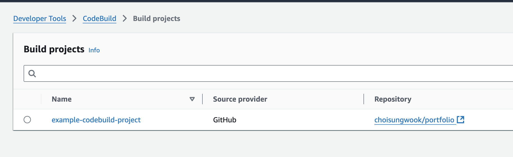

## 개요
* packer를 codebuild로 실행

## 파일 목차
* [packer x86](./al2023-nginx.pkr.hcl)
* [codebuild template](./buildspec.yaml)

## 로컬 실행
* $HOME/.aws/config파일에 설정된 default 프로파일로 codebuild를 로컬로 실행합니다. 아래 예제는 ARM 맥북(aarch64)에서 실행한 예제입니다.

```sh
./codebuild_build.sh \
  -i public.ecr.aws/codebuild/amazonlinux2-aarch64-standard:3.0 \
  -l public.ecr.aws/codebuild/local-builds:aarch64 \
  -c \
  -p default \
  -b buildspec-local.yaml \
  -a artifacts
```

* ARM 맥북에서 실행하려면 [packer 설정](./al2023-nginx.pkr.hcl)에서 인스턴스타입을 graviton으로 변경해야 합니다.

```hcl
source "amazon-ebs" "nginx" {
  ami_name      = "al2023-nginx-{{timestamp}}"
  instance_type = "t4g.medium" # <-- change
```

* AWS console에서 생성된 AMI를 확인합니다.


## codebuild 실행

1. terraform으로 codebuild를 생성합니다.

```sh
terraform init
terraform apply
```

2. codebuild를 실행하고 실행결과가 성공했는지 확인합니다.




3. AMI가 생성되었는지 확인합니다.

## 참고자료
* https://github.com/aws/aws-codebuild-docker-images/blob/master/local_builds/codebuild_build.sh
