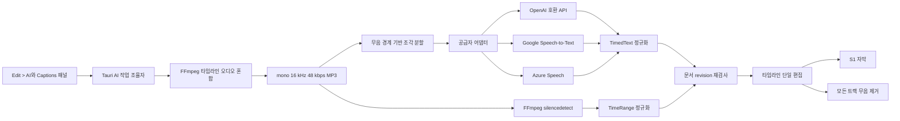

# AI audio 아키텍처와 의사결정

대상 구현은 `akbun-makevideo`의 AI 자막 생성과 무음 제거다. 핵심은 음성 인식 공급자를 편집 모델에서 분리하고, 오래 걸리는 분석 결과를 검증한 뒤 타임라인에 한 번만 적용하는 것이다.

## 반드시 이해할 결론

- Luna, Terra, Sol은 Codex 대화 작업용 모델이며 음성 인식 모델이 아님
- 자막 생성은 별도 음성 API와 별도 자격증명을 사용
- 편집 코어가 아는 전사 형식은 공급자 응답이 아니라 `TimedText { start_ms, end_ms, text }` 하나뿐임
- 무음 제거는 AI 호출이 아니라 로컬 FFmpeg의 신호 분석
- 분석 시작 후 타임라인이 바뀌면 결과를 적용하지 않음
- 자막 삽입과 무음 제거는 각각 한 번의 Undo로 복구 가능

## 전체 구조

UI는 작업 시작과 상태 표시만 담당한다. Rust 작업 조율자가 오디오 생성, 공급자 호출, 취소, 결과 적용의 수명을 소유한다. 분석 crate와 편집 crate는 외부 공급자 인증이나 HTTP를 알지 못한다.

근거:

- UI 진입과 상태 구독: `product/akbun-makevideo/workspace/src/ai-edit-panel.js:183-265`
- Tauri IPC 경계: `product/akbun-makevideo/workspace/src/api.js:422-430`
- 비동기 작업과 revision 스냅샷: `product/akbun-makevideo/workspace/src-tauri/src/ai_edit.rs:150-253`

## 자막 생성 흐름

1. 현재 타임라인의 들리는 클립을 실제 위치, 트림, 속도, 볼륨 기준으로 혼합
2. mono, 16 kHz, 48 kbps MP3로 임시 저장
3. 공급자 최대 길이를 넘으면 무음 중심점 근처에서 조각 분할
4. 경계 앞뒤 500 ms를 겹쳐 잘린 단어 손실 완화
5. 설정된 어댑터가 공급자별 요청과 인증 처리
6. 공급자 응답을 밀리초 단위 `TimedText`로 정규화
7. 겹친 조각에서 생긴 같은 문장과 시간 중첩 제거
8. 시작 revision과 현재 revision이 같을 때만 S1에 자막 삽입
9. 전체 삽입을 `Generate captions` 한 번의 Undo 단계로 저장

분석용 MP3는 편집 원본이 아니다. 네트워크 전송량과 음성 인식 비용을 줄이기 위한 파생 파일이며 작업 전용 임시 디렉터리와 함께 제거된다.

근거:

- 분석 MP3와 조각 인코딩: `product/akbun-makevideo/workspace/src-tauri/crates/render/src/ffmpeg.rs:759-837`
- 무음 경계 조각과 겹침 제거: `product/akbun-makevideo/workspace/src-tauri/crates/analysis/src/lib.rs:203-271`
- 전사 작업 조율: `product/akbun-makevideo/workspace/src-tauri/src/ai_edit.rs:674-781`
- 자막 적용과 revision 확인: `product/akbun-makevideo/workspace/src-tauri/src/ai_edit.rs:858-942`

## 공급자 경계

| 공급자 | 요청 형식 | 시간 정보 | 구현상 조각 최대값 |
|---|---|---|---:|
| OpenAI | `/audio/transcriptions` multipart | verbose JSON segment | 3,000,000 ms |
| LiteLLM | OpenAI 호환 multipart | OpenAI 호환 segment | 3,000,000 ms |
| Custom gateway | OpenAI 호환 multipart | OpenAI 호환 segment | 3,000,000 ms |
| Google Speech-to-Text v2 | `:recognize` JSON + base64 audio | word offset | 55,000 ms |
| Azure Speech | `transcriptions:transcribe` multipart | phrase offset와 duration | 6,000,000 ms |

`TranscriptionAdapter`는 최대 조각 길이, 요청 생성, 응답 파싱만 제공한다. 공급자를 추가할 때 편집 명령을 고치지 않고 이 경계와 정규화 파서만 확장하는 구조다.

OpenAI 호환 모델은 `verbose_json`과 segment timestamp를 반환해야 한다. 텍스트만 반환하는 모델은 자막 위치를 만들 수 없으므로 오류로 처리한다. 기본값이 `whisper-1`인 이유도 segment timestamp 계약이 명확하기 때문이다.

LM Studio는 독립 공급자로 노출하지 않는다. 음성 전사 endpoint가 없는 호환 서버를 지원한다고 표시하면 실행 시점에 실패하기 때문이다. 다른 모델 서버를 연결할 때는 LiteLLM 또는 Custom gateway가 `/audio/transcriptions` 계약을 실제로 제공하는지 먼저 확인한다.

근거:

- 어댑터 계약과 선택: `product/akbun-makevideo/workspace/src-tauri/src/ai_edit.rs:415-425`, `584-601`
- OpenAI 호환 요청: `product/akbun-makevideo/workspace/src-tauri/src/ai_edit.rs:438-482`
- Google 요청: `product/akbun-makevideo/workspace/src-tauri/src/ai_edit.rs:488-531`
- Azure 요청: `product/akbun-makevideo/workspace/src-tauri/src/ai_edit.rs:537-580`
- 공급자별 응답 정규화: `product/akbun-makevideo/workspace/src-tauri/crates/analysis/src/lib.rs:64-160`

## 대화 AI와 음성 AI를 분리한 이유

두 기능은 인증과 과금, 입력, 출력이 다르다.

| 구분 | 대화 AI | 음성 인식 AI |
|---|---|---|
| 용도 | 슬라이드·편집 조언과 생성 | 오디오를 시간 포함 텍스트로 변환 |
| 연결 | Codex App Server | OpenAI, Google, Azure 또는 gateway HTTP API |
| 모델 설정 | Luna, Terra, Sol과 reasoning effort | `whisper-1` 등 공급자별 speech model |
| 인증 | Codex의 ChatGPT 로그인 | 현재 앱 세션의 공급자 credential |
| 핵심 출력 | 대화 응답 | `TimedText` 목록 |

대화 모델 목록은 사용 가능한 구독 모델을 Codex App Server에서 읽는다. 이 설정을 음성 API에 재사용하지 않는다. 같은 OpenAI 이름이 보여도 ChatGPT 구독이 OpenAI 음성 API 사용료나 API key를 대신하지 않기 때문이다.

공급자 credential은 provider별 메모리에만 저장한다. endpoint, 모델, 언어는 설정에 남지만 credential은 설정 파일과 프로젝트 파일에 기록하지 않는다.

근거:

- 대화 모델과 effort 선택: `product/akbun-makevideo/workspace/src/ai-panel.js:90-140`, `637-654`
- 설정의 인증 경계와 기본값: `product/akbun-makevideo/workspace/src-tauri/src/commands.rs:111-122`, `150-158`
- 세션 credential 저장: `product/akbun-makevideo/workspace/src-tauri/src/ai_edit.rs:72-126`

## 무음 제거 흐름

무음 제거에 언어 모델을 쓰지 않는다.

1. 자막 생성과 같은 타임라인 혼합 MP3 생성
2. FFmpeg `silencedetect`로 기본 -35 dB 이하가 450 ms 이상인 구간 탐지
3. 구간 양쪽에 기본 120 ms를 남겨 첫소리와 끝소리 손실 방지
4. 밀리초 구간을 프로젝트 frame rate에 맞는 frame range로 변환
5. 모든 비디오, 오디오, 자막, visual item, marker를 같은 시간만큼 자르고 왼쪽으로 이동
6. 전환을 다시 검증하고 편집 전 전체 타임라인 스냅샷을 Undo로 보존

이 방식은 빠르고 비용이 없으며 오디오를 외부로 보내지 않는다. 반면 의미상 필요한 침묵과 불필요한 침묵을 구분하지 못하므로 threshold, 최소 길이, padding을 사용자가 조정할 수 있어야 한다.

근거:

- `silencedetect` 설정: `product/akbun-makevideo/workspace/src-tauri/src/ai_edit.rs:337-358`
- 무음 구간과 padding 계산: `product/akbun-makevideo/workspace/src-tauri/crates/analysis/src/lib.rs:167-201`
- 무음 분석과 적용: `product/akbun-makevideo/workspace/src-tauri/src/ai_edit.rs:785-855`, `959-980`
- 전체 트랙 제거와 Undo 스냅샷: `product/akbun-makevideo/workspace/src-tauri/crates/edit/src/command.rs:2272-2306`

## 핵심 의사결정

| 결정 | 이유 | 감수한 점 |
|---|---|---|
| 공급자 응답을 `TimedText`로 정규화 | 편집 코어를 벤더 JSON에서 분리 | 새 공급자마다 adapter와 parser 필요 |
| 분석 오디오를 mono 16 kHz 48 kbps MP3로 통일 | 음성에는 충분하면서 파일과 업로드 비용이 작음 | 손실 압축이므로 음악 분석에는 부적합 |
| 무음 근처에서 겹쳐 분할 | 공급자 제한을 지키며 경계 단어 손실 감소 | 겹침 중복 제거 정책 필요 |
| 작업 시작 revision을 적용 직전에 재검사 | 오래된 timestamp가 바뀐 타임라인을 훼손하지 않음 | 분석 중 일반 편집을 제한해야 함 |
| 작업이 결과 적용까지 소유 | 취소와 실패가 부분 자막이나 부분 컷을 남기지 않음 | 동시에 AI 작업 하나만 실행 가능 |
| 결과 전체를 단일 Undo로 저장 | 사용자가 AI 결과를 한 번에 거부 가능 | 큰 무음 편집은 전체 타임라인 스냅샷 비용 발생 |
| credential을 메모리에만 저장 | 프로젝트와 설정 파일의 비밀 유출 방지 | 앱 재시작 후 다시 입력 필요 |
| 무음 제거를 로컬 신호 분석으로 구현 | 결정적이고 빠르며 API 비용과 업로드 없음 | 의미 있는 쉼을 자동 판별하지 못함 |

원본 결정 기록:

- [공급자 중립 음성 편집 ADR](../../akbun-makevideo/adr/2026-09-provider-neutral-speech-editing.md)
- [AI media 작업의 적용 경계](../../akbun-makevideo/knowledge/decisions/2026-09-ai-media-jobs-own-the-apply-boundary.md)

## 실패해도 지켜야 하는 조건

| 상황 | 동작 |
|---|---|
| 타임라인에 들리는 오디오가 없음 | 작업 실패, 편집 없음 |
| 다른 AI 편집이 실행 중 | 새 작업 거절 |
| 렌더가 실행 중 | AI 작업 시작 거절 |
| 사용자가 취소 | FFmpeg 종료 또는 HTTP future 중단, 편집 없음 |
| 공급자 인증·응답 오류 | 오류 표시, 편집 없음 |
| timestamp가 없는 응답 | 오류 처리, 임의 시간 생성 안 함 |
| 분석 중 timeline revision 변경 | stale 결과 폐기, 편집 없음 |
| 성공 | 자막 또는 무음 제거 전체를 한 번에 적용 |

## 스스로 확인할 질문

1. Luna를 `whisper-1` 대신 자막 모델로 바로 사용할 수 없는 이유는 무엇인가?
2. 새 음성 공급자를 추가할 때 편집 crate를 바꾸지 않아도 되는 이유는 무엇인가?
3. 500 ms 겹침 분할이 해결하는 문제와 새로 만드는 문제는 무엇인가?
4. 무음 제거가 모든 트랙에 같은 범위를 적용해야 하는 이유는 무엇인가?
5. revision 재검사가 없으면 어떤 형태로 프로젝트가 손상될 수 있는가?
