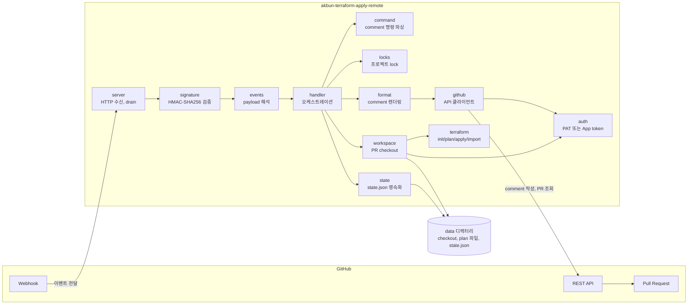
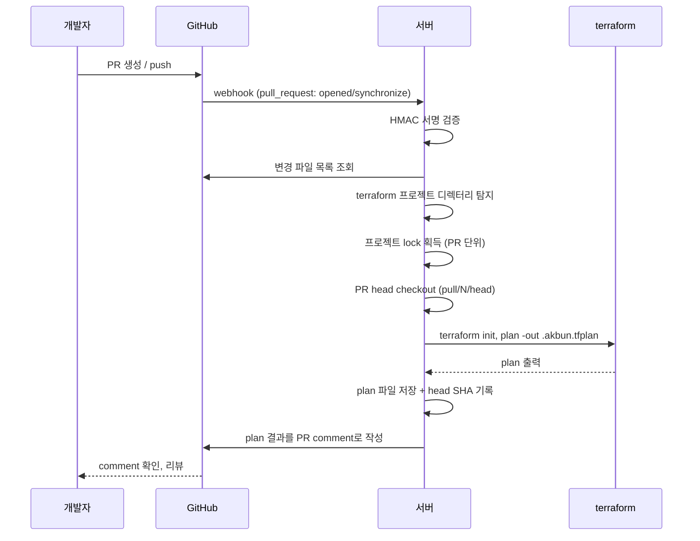
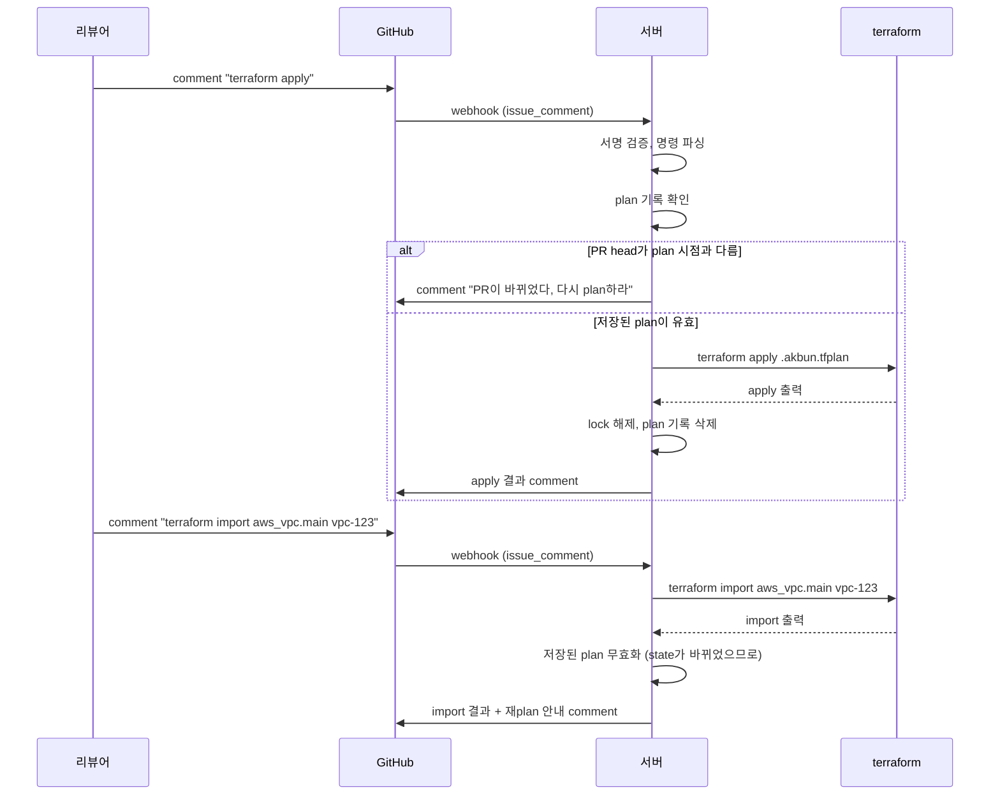
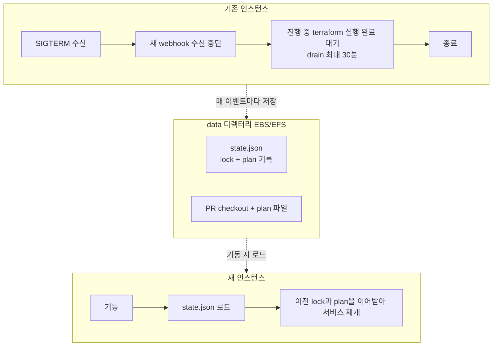
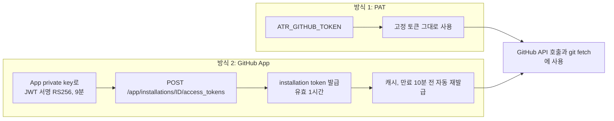

# 아키텍처

akbun-terraform-apply-remote의 구조와 핵심 흐름을 정리한다. 설계 의도는 세 가지다.

1. PR이 생성되면 자동으로 plan하고 결과를 PR comment로 남긴다.
2. PR comment로 plan을 다시 실행하고, apply와 import를 실행할 수 있다.
3. 인증은 장기 PAT 또는 GitHub App의 임시 installation token 중 선택한다.

## 전체 구성

GitHub webhook을 받아 terraform을 실행하고 결과를 PR comment로 돌려주는 단일 바이너리 서버다.

- webhook은 서명 검증을 통과해야만 처리된다. 즉시 200으로 응답하고 실제 작업은 백그라운드 스레드에서 실행해 GitHub의 10초 timeout을 피한다.
- 핵심 판단 로직(command, signature, project, format, locks, state, jobs, auth 선택)은 순수 함수/자료구조로 분리해 단위 테스트로 검증한다.

## 흐름 1: PR 생성 시 자동 plan

PR이 열리거나(head가 갱신되어도 동일) 변경 파일에 terraform 파일이 있으면 자동으로 plan하고 결과를 comment로 남긴다.

## 흐름 2: comment로 plan / apply / import

리뷰어는 PR comment로 서버를 조작한다. apply는 새로 plan하지 않고 **마지막 plan이 저장한 파일**을 그대로 적용한다.

명령 요약:

| comment | 동작 |
|---|---|
| terraform plan [-d dir] | 변경된(또는 지정한) 프로젝트를 plan |
| terraform apply [-d dir] | 저장된 plan 파일을 apply |
| terraform import [-d dir] 주소 ID | 기존 리소스를 state로 import, 이후 재plan 요구 |
| terraform unlock | 이 PR의 lock 전부 해제 |
| terraform help | 사용법 안내 |

## 동시성 제어: 프로젝트 lock과 저장된 plan

- 프로젝트 디렉터리(예: aws/vpc)를 처음 plan한 PR이 lock을 잡는다. 다른 PR은 그 프로젝트를 apply 성공, PR close, unlock 전까지 건드릴 수 없다. 같은 state를 두 PR이 경쟁하는 것을 막는다.
- apply는 저장된 plan 파일과 plan 시점의 head SHA를 검증한다. 리뷰한 내용과 적용되는 내용이 항상 일치한다.
- plan이 실패하면 이전 plan 기록을 지워 오래된 plan이 apply되는 것을 막는다. lock은 유지된다(그 PR이 프로젝트를 점유 중).

## 배포와 인수인계 (takeover)

배포는 두 장치 위에서 무중단으로 동작한다. 상세는 [deploy-guide.md](./deploy-guide.md)를 본다.

- 모든 이벤트 처리 후 lock과 plan 기록을 state.json에 저장하므로, 새 인스턴스는 배포 직전 상태에서 이어서 동작한다.
- EC2 배포는 systemd timer가 새 바이너리를 감지해 교체하는 self-deploy, ECS 배포는 rolling 교체(EFS 공유)로 같은 성질을 만든다.

## 인증: PAT 또는 GitHub App 임시 토큰

GitHub 접근 토큰은 두 방식 중 하나를 선택한다. 장기 토큰을 두고 싶지 않으면 GitHub App 방식을 쓴다.

- App 방식에서는 장기 자격증명이 런타임에 존재하지 않는다. private key는 디스크에만 있고, 실제로 쓰이는 토큰은 1시간짜리 installation token이다.
- 토큰은 API 호출과 git fetch 시점마다 provider에서 꺼내 쓰므로, 긴 작업 중에도 만료 전에 자동 갱신된다.
- git fetch는 토큰을 remote URL에 넣지 않고 Authorization 헤더로만 전달해 디스크에 토큰이 남지 않는다.
- App 설정 절차는 [user-guide.md](./user-guide.md)의 인증 옵션 절을 따른다.
