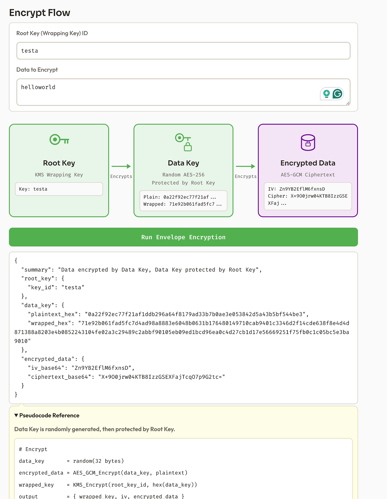

# Envelope Encryption Simulator

- KMS Envelope Encryption Simulator 프로젝트입니다. 봉투암호화 수도코드를 간단히 보여주고 봉투암호화 암호화/복호화 과정을 간단히 느낄수 있게 하는게 목표입니다.
- 도메인: envelopelab.akbun.com
- 이론 설명: https://malwareanalysis.tistory.com/906

