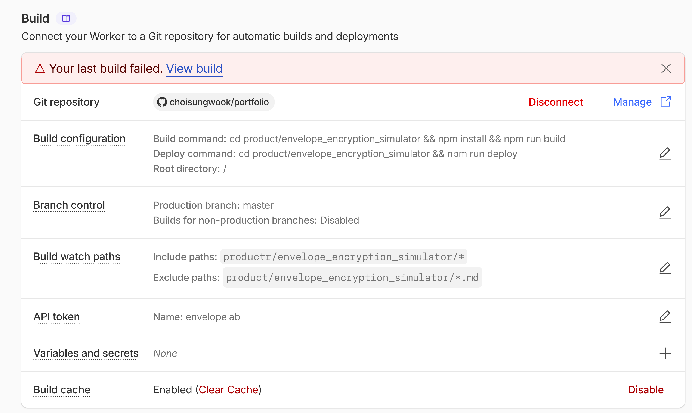

# How to deploy?

## 1단계: Cloudflare Pages 프로젝트 생성

1. Cloudflare Dashboard → Workers & Pages → Create → Pages → Connect to Git
2. GitHub 리포 선택: `choisungwook/portfolio`
3. Build settings:
   - **Build command**: `cd product/envelope_encryption_simulator && npm install && npm run build`
   - **Deploy command**: `cd product/envelope_encryption_simulator && npm run deploy`
   - **Build output directory**: `product/envelope_encryption_simulator/dist`
   - **Root directory**: `/` (monorepo이므로 루트)
4. Deploy

## 2단계: 커스텀 도메인 연결

1. Pages 프로젝트 → Custom domains → `envelopelab.akbun.com`
2. Cloudflare가 자동으로 DNS CNAME 생성 + SSL 설정

## 3단계: Build Watch Paths 설정

monorepo이므로 특정 폴더 변경 시에만 빌드가 트리거되도록 설정한다.

1. Pages 프로젝트 → Settings → Builds & deployments → **Build watch paths**
2. Include paths: `product/envelope_encryption_simulator/**`
3. Exclude paths: `product/envelope_encryption_simulator/*.md` (md 파일 변경은 빌드 제외)

이렇게 하면 `product/envelope_encryption_simulator/` 하위 파일이 변경된 커밋만 빌드를 트리거하고, 다른 폴더의 변경은 무시한다.

## 4단계: 배포

master 브랜치에 push하면 Cloudflare Pages가 자동 빌드/배포.
