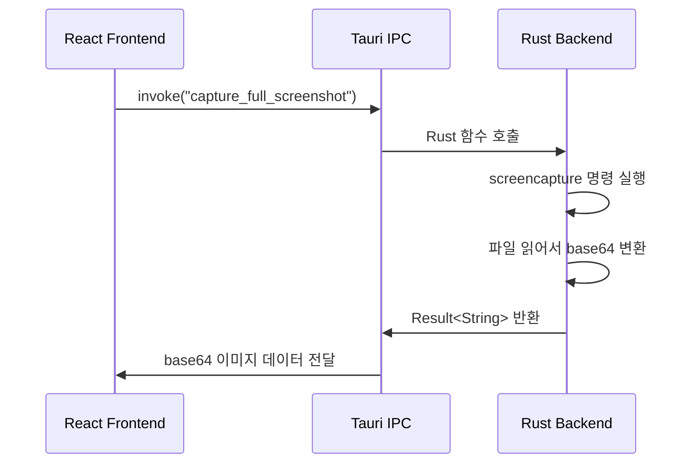

# 요약

- 크로스플랫폼 스크린샷 캡처 데스크톱 앱을 Tauri v2 + React + TypeScript로 만들었다
- **Tauri는 Rust 백엔드 + 웹 프론트엔드 조합으로 동작하는 크로스플랫폼 데스크톱 프레임워크**이다
- 스크린샷 캡처는 OS 네이티브 명령어(macOS `screencapture`)를 Rust에서 호출하는 방식으로 구현했다
- 이미지 편집기는 HTML5 Canvas API로 직접 구현했다. 사각형 강조, 번호 매기기, 선, 화살표, 텍스트 삽입이 가능하다
- 프론트엔드와 백엔드 사이의 통신은 Tauri의 `invoke` 시스템(IPC)을 사용한다

# 목차

1. [왜 Tauri를 선택했을까?](#왜-tauri를-선택했을까)
2. [Tauri 앱의 구조](#tauri-앱의-구조)
3. [프론트엔드와 백엔드는 어떻게 통신할까?](#프론트엔드와-백엔드는-어떻게-통신할까)
4. [스크린샷 캡처는 어떻게 동작할까?](#스크린샷-캡처는-어떻게-동작할까)
5. [캡처 후 흐름: Copy, Save, Edit](#캡처-후-흐름-copy-save-edit)
6. [이미지 편집기는 어떻게 만들었을까?](#이미지-편집기는-어떻게-만들었을까)
7. [Tauri 플러그인 시스템](#tauri-플러그인-시스템)
8. [프로젝트 구조 정리](#프로젝트-구조-정리)
9. [더 공부할 것](#더-공부할-것)
10. [참고자료](#참고자료)

# 왜 Tauri를 선택했을까?

크로스플랫폼 데스크톱 앱을 만들 수 있는 프레임워크는 여러 가지가 있다.

| 프레임워크 | 언어 | 번들 크기 | 특징 |
|-----------|------|----------|------|
| Electron | JavaScript | ~150MB | Chromium 통째로 포함 |
| Tauri | Rust + Web | ~10MB | OS 내장 WebView 사용 |
| Flutter | Dart | ~20MB | 자체 렌더링 엔진 |

**Tauri를 선택한 이유는 크게 3가지이다.**

1. **크로스플랫폼 지원**: macOS, Windows, Linux 모두 빌드 가능하다
2. **경량**: Electron처럼 Chromium을 통째로 포함하지 않는다. OS에 내장된 WebView를 사용하기 때문에 번들 크기가 훨씬 작다
3. **웹 기술 활용**: 프론트엔드를 React, Vue 등 익숙한 웹 프레임워크로 만들 수 있다

정리하면, Tauri는 "가벼운 Electron"이라고 이해하면 된다. Electron이 Chromium 브라우저를 통째로 앱에 넣는 반면, Tauri는 OS가 이미 가지고 있는 WebView를 재활용한다.

# Tauri 앱의 구조

Tauri 앱은 두 가지 단어를 합친 구조이다. **Rust 백엔드** + **Web 프론트엔드**

1. **Rust 백엔드** (`src-tauri/`): 시스템 레벨 작업을 담당한다. 파일 읽기/쓰기, OS 명령 실행, 클립보드 접근 등
2. **Web 프론트엔드** (`src/`): 사용자가 보는 UI를 담당한다. React + TypeScript로 작성했다

[아키텍처 그림: Tauri 앱 구조 - Rust Backend와 Web Frontend가 IPC로 통신하는 다이어그램]

```
┌─────────────────────────────────────────┐
│             Tauri Application            │
│                                          │
│  ┌──────────────┐    ┌───────────────┐  │
│  │  Web Frontend │◄──►│ Rust Backend  │  │
│  │  (React + TS) │ IPC │  (Tauri Core) │  │
│  │              │    │               │  │
│  │  - UI 렌더링  │    │ - screencapture│  │
│  │  - Canvas 편집│    │ - 파일 저장    │  │
│  │  - 상태 관리  │    │ - base64 변환  │  │
│  └──────────────┘    └───────────────┘  │
│         │                    │           │
│    OS WebView           OS 시스템 API    │
└─────────────────────────────────────────┘
```

## 왜 백엔드가 Rust일까?

웹 브라우저(WebView)는 보안상 시스템 리소스에 직접 접근할 수 없다. 파일을 저장하거나, OS 명령어를 실행하거나, 클립보드에 접근하려면 네이티브 코드가 필요하다.

**Tauri는 이 네이티브 레이어를 Rust로 작성한다.** Rust는 메모리 안전성이 보장되면서도 C/C++ 수준의 성능을 제공하기 때문이다.

# 프론트엔드와 백엔드는 어떻게 통신할까?

여기서 핵심 개념이 **IPC(Inter-Process Communication)**이다.

IPC는 두 가지 단어를 합친 용어이다. Inter-Process + Communication
1. **Inter-Process**: 프로세스 간(서로 다른 프로그램 사이)
2. **Communication**: 통신, 데이터 주고받기
3. **IPC**: 서로 다른 프로세스가 데이터를 주고받는 메커니즘

Tauri에서는 `invoke`라는 함수로 IPC를 수행한다. 웹에서 API 호출하는 것과 비슷하다고 생각하면 된다.

## Rust 쪽 (백엔드): Command 정의

```rust
#[tauri::command]
fn capture_full_screenshot() -> Result<String, String> {
    // OS 명령 실행, 파일 읽기 등 시스템 작업
    Ok(format!("data:image/png;base64,{}", base64_data))
}
```

`#[tauri::command]`라는 매크로를 붙이면, 이 Rust 함수를 프론트엔드에서 호출할 수 있게 된다.

## TypeScript 쪽 (프론트엔드): invoke 호출

```typescript
import { invoke } from "@tauri-apps/api/core";

const imageData = await invoke<string>("capture_full_screenshot");
```

`invoke("함수이름")`을 호출하면, Tauri가 내부적으로 Rust 함수를 실행하고 결과를 반환해준다.

정리하면, **웹에서 REST API를 호출하는 것처럼 `invoke`로 Rust 함수를 호출하는 구조**이다.



# 스크린샷 캡처는 어떻게 동작할까?

스크린샷 캡처는 OS에서 제공하는 네이티브 명령어를 사용한다.

macOS에는 `screencapture`라는 CLI 도구가 내장되어 있다. 터미널에서 직접 실행해볼 수 있다.

```bash
# 전체 화면 캡처
screencapture -x /tmp/screenshot.png

# 영역 선택 캡처 (-i 옵션)
screencapture -i -x /tmp/screenshot.png
```

`-x` 옵션은 캡처 사운드를 끄는 옵션이다. `-i` 옵션은 interactive mode로, 사용자가 마우스로 영역을 선택할 수 있게 한다.

## Rust에서 OS 명령 실행하는 방법

```rust
let output = std::process::Command::new("screencapture")
    .arg("-x")
    .arg(&file_path_str)
    .output()
    .map_err(|e| format!("Failed to execute screencapture: {}", e))?;
```

`std::process::Command`는 Rust 표준 라이브러리에서 제공하는 OS 명령 실행 기능이다. Node.js의 `child_process.exec()`과 비슷한 역할이다.

## 전체 흐름

1. 사용자가 "Full Screen" 버튼 클릭
2. React → `invoke("capture_full_screenshot")` 호출
3. Rust → `screencapture -x /tmp/screencapture_full.png` 실행
4. Rust → 생성된 PNG 파일을 읽어서 base64로 인코딩
5. Rust → `data:image/png;base64,...` 형태로 프론트엔드에 반환
6. React → 반환된 base64 데이터를 `` 태그에 표시

그런데, 왜 이미지를 파일로 저장했다가 다시 읽을까? **macOS `screencapture` 명령이 결과를 파일로만 출력하기 때문이다.** stdout으로 이미지 데이터를 보내주지 않는다. 따라서 임시 파일에 저장 → 읽기 → 삭제 순서로 처리했다.

# 캡처 후 흐름: Copy, Save, Edit

스크린샷을 캡처한 뒤에는 3가지 액션이 가능하다.

## Copy (클립보드 복사)

Tauri의 `clipboard-manager` 플러그인을 사용한다.

```typescript
import { writeText } from "@tauri-apps/plugin-clipboard-manager";

const base64Only = imageData.split(",")[1] || imageData;
await writeText(base64Only);
```

## Save (파일 저장)

Tauri의 `dialog` 플러그인으로 네이티브 파일 저장 다이얼로그를 띄운다. 사용자가 경로를 선택하면 Rust 백엔드에서 base64를 디코딩하여 PNG 파일로 저장한다.

```typescript
import { save } from "@tauri-apps/plugin-dialog";

const filePath = await save({
  filters: [{ name: "PNG Image", extensions: ["png"] }],
  defaultPath: `screenshot_${Date.now()}.png`,
});
```

`save()` 함수를 호출하면 macOS에서는 Finder 스타일의 저장 다이얼로그가 뜬다. Windows에서는 Windows 스타일의 저장 다이얼로그가 뜬다. **Tauri가 OS별 네이티브 다이얼로그를 알아서 처리해준다.**

## Edit (이미지 편집)

Edit 버튼을 누르면 Canvas 기반 이미지 편집기 화면으로 전환된다. 이 부분은 다음 섹션에서 자세히 다룬다.

# 이미지 편집기는 어떻게 만들었을까?

이미지 편집기는 **HTML5 Canvas API**로 구현했다.

## Canvas API란?

Canvas는 브라우저에서 제공하는 2D 그래픽 API이다. `<canvas>` HTML 요소 위에 JavaScript로 도형, 텍스트, 이미지를 그릴 수 있다.

별도 라이브러리 없이 브라우저 내장 기능만으로 이미지 위에 그림을 그릴 수 있어서 선택했다.

## 편집 도구 5가지

| 도구 | 설명 | Canvas API |
|------|------|-----------|
| Rectangle | 색상 있는 테두리 직사각형 | `strokeRect()` |
| Line | 직선 | `moveTo()` + `lineTo()` |
| Arrow | 화살표 (직선 + 삼각형 머리) | `lineTo()` + 삼각함수 |
| Circle Number | 자동 번호가 있는 원형 마커 | `arc()` + `fillText()` |
| Text | 텍스트 삽입 | `fillText()` |

## 핵심 구현 패턴: Annotation 배열

편집기의 핵심 아이디어는 **모든 편집 내용을 Annotation 배열로 관리**하는 것이다.

```typescript
interface Annotation {
  type: Tool;          // "rectangle" | "line" | "arrow" | "circle-number" | "text"
  startX: number;
  startY: number;
  endX: number;
  endY: number;
  color: string;
  text?: string;       // text 도구일 때만
  number?: number;     // circle-number 도구일 때만
}
```

사용자가 도형을 그릴 때마다 Annotation 객체가 배열에 추가된다. 화면을 다시 그릴 때는 배경 이미지를 먼저 그리고, 배열에 있는 Annotation을 순서대로 그린다.

```typescript
const drawAll = () => {
  ctx.drawImage(bgImage, 0, 0);       // 1. 배경 이미지
  for (const ann of annotations) {
    drawAnnotation(ctx, ann);          // 2. 각 Annotation 그리기
  }
};
```

**이 방식의 장점은 Undo(실행 취소)가 쉽다는 것이다.** 배열에서 마지막 요소를 제거하고 다시 그리기만 하면 된다.

## 좌표 변환이 필요한 이유

고해상도 스크린샷(예: 3840x2160)을 화면에 맞게 축소해서 보여준다. 이때 Canvas의 실제 크기와 화면에 보이는 크기가 다르다.

```typescript
canvas.width = img.width;              // 실제 Canvas 크기: 3840
canvas.style.width = `${img.width * scale}px`;  // 화면 표시 크기: 1200
```

마우스 클릭 좌표(화면 기준)를 실제 Canvas 좌표로 변환해야 정확한 위치에 도형이 그려진다.

```typescript
const getCanvasCoords = (e: React.MouseEvent) => {
  const rect = canvas.getBoundingClientRect();
  return {
    x: (e.clientX - rect.left) / canvasScale,
    y: (e.clientY - rect.top) / canvasScale,
  };
};
```

# Tauri 플러그인 시스템

Tauri는 플러그인 시스템으로 기능을 확장한다. 이 프로젝트에서 사용한 플러그인은 4개이다.

| 플러그인 | Rust 크레이트 | npm 패키지 | 역할 |
|---------|-------------|-----------|------|
| Shell | `tauri-plugin-shell` | `@tauri-apps/plugin-shell` | OS 명령 실행 |
| Dialog | `tauri-plugin-dialog` | `@tauri-apps/plugin-dialog` | 파일 저장 다이얼로그 |
| FS | `tauri-plugin-fs` | `@tauri-apps/plugin-fs` | 파일 시스템 접근 |
| Clipboard | `tauri-plugin-clipboard-manager` | `@tauri-apps/plugin-clipboard-manager` | 클립보드 읽기/쓰기 |

각 플러그인은 Rust 크레이트와 npm 패키지 두 가지로 구성된다. Rust 쪽에서 시스템 기능을 제공하고, npm 패키지로 프론트엔드에서 호출할 수 있는 API를 제공하는 구조이다.

## 플러그인 등록

Rust `lib.rs`에서 플러그인을 등록한다.

```rust
tauri::Builder::default()
    .plugin(tauri_plugin_shell::init())
    .plugin(tauri_plugin_dialog::init())
    .plugin(tauri_plugin_fs::init())
    .plugin(tauri_plugin_clipboard_manager::init())
```

## 권한(Capabilities) 설정

Tauri v2에서는 보안을 위해 **Capabilities 시스템**을 사용한다. 프론트엔드에서 사용할 수 있는 API를 명시적으로 허용해야 한다.

```json
{
  "identifier": "default",
  "permissions": [
    "core:default",
    "shell:allow-execute",
    "dialog:allow-save",
    "clipboard-manager:allow-write-text"
  ]
}
```

**허용하지 않은 API는 프론트엔드에서 호출해도 차단된다.** 웹 앱이 시스템 리소스에 무제한으로 접근하는 것을 방지하기 위한 보안 설계이다.

# 프로젝트 구조 정리

```
product/screenshot/
├── src-tauri/                    # Rust 백엔드
│   ├── Cargo.toml                # Rust 의존성 관리 (npm의 package.json 역할)
│   ├── tauri.conf.json           # Tauri 앱 설정 (창 크기, 번들링 등)
│   ├── capabilities/default.json # 보안 권한 설정
│   └── src/
│       ├── main.rs               # 앱 진입점
│       └── lib.rs                # 스크린샷 캡처, 파일 저장 Tauri 커맨드
│
├── src/                          # React 프론트엔드
│   ├── main.tsx                  # React 진입점
│   ├── App.tsx                   # 앱 상태 관리 (home → preview → editor)
│   ├── App.css                   # 전체 스타일
│   ├── components/
│   │   ├── CaptureButtons.tsx    # 메인 화면: Full Screen, Select Region 버튼
│   │   ├── PreviewOverlay.tsx    # 캡처 후 미리보기: Copy, Save, Edit 버튼
│   │   └── ImageEditor.tsx       # Canvas 기반 이미지 편집기
│   └── utils/
│       └── screenshot.ts         # Tauri invoke 래퍼 함수들
│
├── package.json                  # npm 의존성
├── vite.config.ts                # Vite 번들러 설정
└── index.html                    # HTML 진입점
```

## 화면 전환 흐름

앱은 3개 화면으로 구성된다. `App.tsx`에서 `view` 상태로 관리한다.

```
home (버튼 2개) → preview (미리보기 + 액션 3개) → editor (Canvas 편집기)
     │                    │                              │
     │                    ├─ Copy → 클립보드 복사         │
     │                    ├─ Save → 파일 저장             │
     │                    └─ Edit ─────────────────────►  │
     │                                                    │
     └──────────────── Close / Done ◄─────────────────────┘
```

# 더 공부할 것

- Windows에서는 `screencapture` 명령이 없다. PowerShell의 `[System.Windows.Forms.Screen]`이나 외부 라이브러리를 사용해야 한다
- 이미지를 클립보드에 복사할 때 현재는 base64 텍스트로 복사한다. 실제 이미지 바이너리를 클립보드에 넣으려면 추가 구현이 필요하다
- Tauri v2의 `tray` 기능으로 시스템 트레이 아이콘을 추가하면 더 편리하게 사용할 수 있다
- 글로벌 단축키(예: Cmd+Shift+4) 등록은 `tauri-plugin-global-shortcut`으로 가능하다

# 참고자료

- https://v2.tauri.app/
- https://v2.tauri.app/develop/calling-rust/
- https://v2.tauri.app/plugin/
- https://developer.mozilla.org/en-US/docs/Web/API/Canvas_API
- https://ss64.com/mac/screencapture.html
