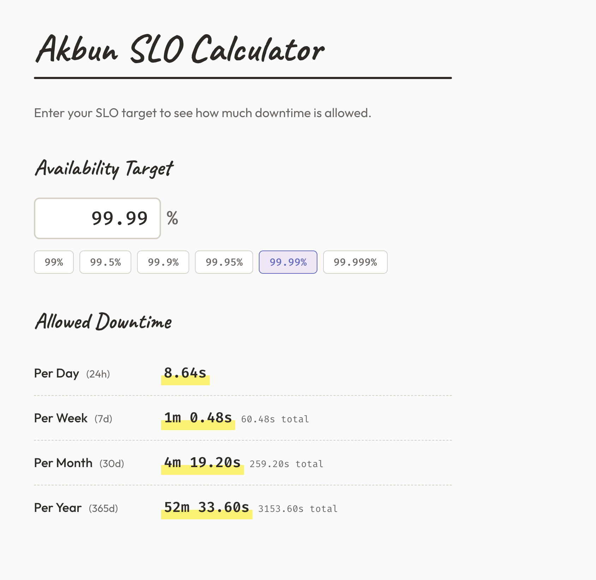

# SLO Downtime Calculator

SLO 가용성(예: 99.99%)을 입력하면 허용 다운타임을 보여주는 웹 도구.

| Availability | Per Day | Per Month (30d) | Per Year (365d) |
|-------------|---------|-----------------|-----------------|
| 99% | 14m 24s | 7h 12m | 3d 15h 36m |
| 99.9% | 1m 26s | 43m 12s | 8h 45m 36s |
| 99.99% | 8.64s | 4m 19s | 52m 33s |
| 99.999% | 0.86s | 25.92s | 5m 15s |



## 아키텍처

```bash
Browser → Cloudflare CDN (HTTPS) → S3 Website Endpoint (HTTP)
               ↑
         Cloudflare DNS (CNAME, Proxied)
```

- **Cloudflare** Free: CDN, DNS, SSL (Flexible), DDoS 방어
- **S3**: 정적 웹사이트 호스팅, Referer 비밀값으로 origin 보호
- **캐시**: Cloudflare Edge 캐시만 사용 (브라우저 캐시 없음)
- **비용**: $0/month

## 배포

### 1. Terraform

```bash
cd product/slo/terraform
cp terraform.tfvars.example terraform.tfvars
# terraform.tfvars 편집 (cloudflare_referer_secret 포함)
terraform init -backend-config=backend.hcl
terraform plan && terraform apply
```

### 2. Cloudflare Console (수동)

- DNS: CNAME `slo` → Terraform output `s3_website_endpoint` (Proxied)
- SSL/TLS: Flexible
- Transform Rules → Modify Request Header: `Referer`를 terraform.tfvars의 비밀값과 동일하게 설정
- Cache Rules: `slo.akbun.com` hostname, Edge TTL 1일

### 3. GitHub Secrets

| Secret | 출처 |
|--------|------|
| `SLO_DEPLOY_ROLE_ARN` | Terraform output |
| `SLO_S3_BUCKET` | Terraform output |
| `CLOUDFLARE_ZONE_ID` | Cloudflare Console |
| `CLOUDFLARE_API_TOKEN` | Cloudflare Console |

### 수동 배포

```bash
aws s3 sync frontend/ s3://slo.akbun.com --delete --cache-control "no-cache, max-age=0"
```
