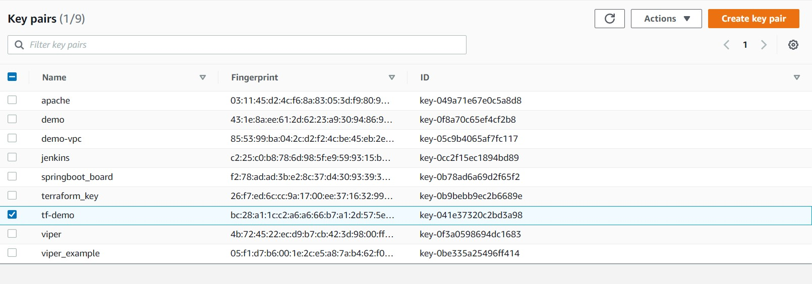

# 개요
* ec2 keypair 생성

# 준비
## aws 접속 정보를 환경변수로 설정
```sh
export AWS_ACCESS_KEY_ID="<AWS_ACCESS_KEY_ID>"
export AWS_SECRET_ACCESS_KEY="<AWS_SECRET_ACCESS_KEY>"
```

## 공개키/비밀키 키 페어 생성
```sh
ssh-keygen -t rsa -b 4096 -f "$HOME/.ssh/aws" -N ""
```


# 실행
```sh
terraform apply
```

