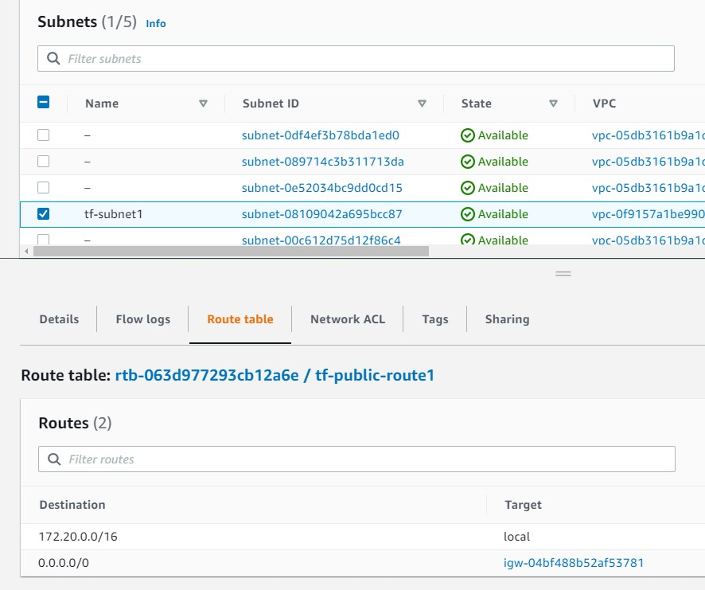
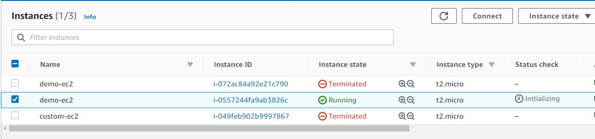

# 개요
* vpc, subnet, igw 생성
* 생성한 vpc안에 ec2생성과 외부 통신 테스트

# 준비
## aws 인증정보 설정
```sh
export AWS_ACCESS_KEY_ID="<AWS_ACCESS_KEY_ID>"
export AWS_SECRET_ACCESS_KEY="<AWS_SECRET_ACCESS_KEY>"
```

## ec2 공개키/비밀키 키 페어 생성
```sh
ssh-keygen -t rsa -b 4096 -f "$HOME/.ssh/aws" -N ""
```

# 실행
* 명령어
```
terraform apply
```

* vpc


* subnet


* internet gateway


* ec2


* keypair


* security group


# 참고자료
* [1] 블로그: https://www.44bits.io/ko/post/terraform_introduction_infrastrucute_as_code#%ED%85%8C%EB%9D%BC%ED%8F%BC-%EC%84%A4%EC%B9%98
* [2] terraform 공식문서-security group: https://registry.terraform.io/providers/hashicorp/aws/latest/docs/resources/security_group
* [3] terraform 공식문서-ec2 instance: https://registry.terraform.io/providers/hashicorp/aws/latest/docs/resources/instance
* [4] terraform 공식문서-ami: https://registry.terraform.io/providers/hashicorp/aws/latest/docs/data-sources/ami
* [5] terrform공식문서-subnet: https://registry.terraform.io/providers/hashicorp/aws/latest/docs/resources/subnet
* [6] terraform공식문서-routing table: https://registry.terraform.io/providers/hashicorp/aws/latest/docs/resources/route_table
* [7] terraform공식문서-routing table association: https://registry.terraform.io/providers/hashicorp/aws/latest/docs/resources/route_table_association
* [8] terraform공식문서-internet gateway: https://registry.terraform.io/providers/hashicorp/aws/latest/docs/resources/internet_gateway