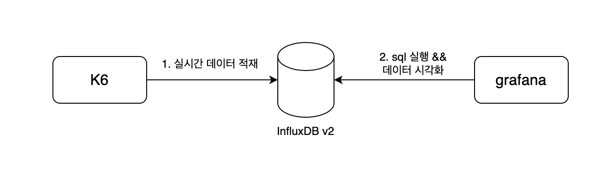
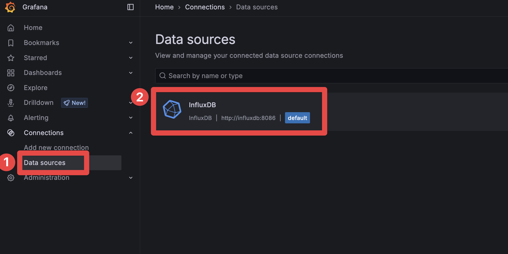
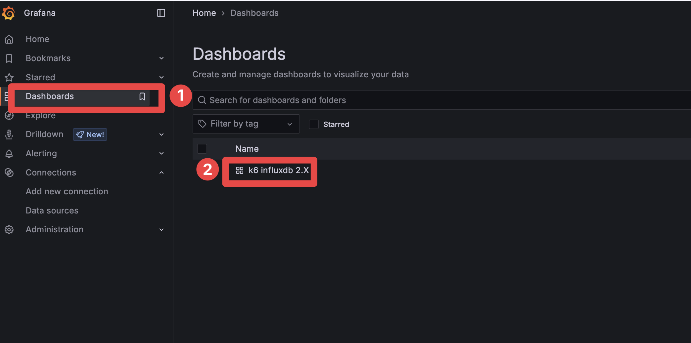
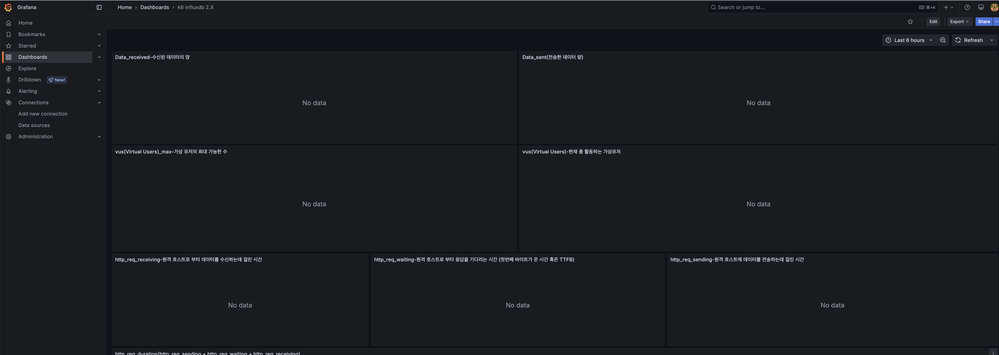

## 개요

* docker compose를 사용하여 k6 데이터를 influxDB v2에 저장하고 grafana에서 시각화

## 아키텍처



## 접속 주소

* grafana: http://127.0.0.1:3000
  * id/password: admin/password1234
* influxdb: http://127.0.0.1:8086
  * id/password: admin/password1234
  * org: my_org
  * bucket: k6_results
  * token: password1234

## 생성 방법

1. docker compose up

```sh
docker compose up -d
```

2. grafana 접속: http://127.0.0.1:3000

3. connection 확인



4. dashboard 확인

* k6의 influxdb v2 대시보드가 import 되어 있습니다.





## 삭제 방법

```sh
docker compose down
```
