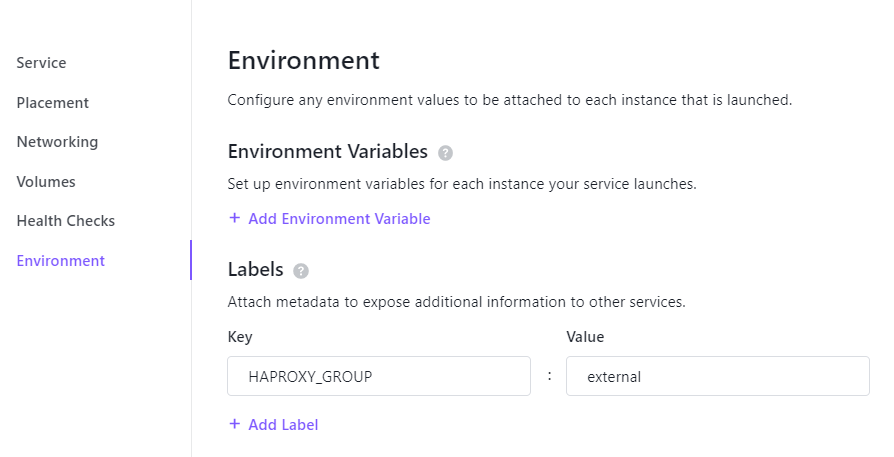
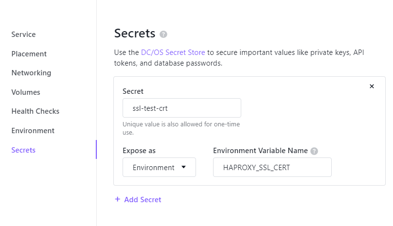
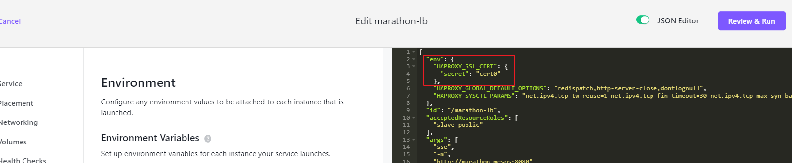

# 개요
* marathon-lb 설정

# 로드 밸런스 설정
* 각 pod label을 external로 설정
```json
{
  "labels": {
    "HAPROXY_GROUP": "external"
  },
  ...
}
```



# ssl 설정
* secret 추가: 인증서와 private key를 secret 리소스에 추가


* marathon-lb 컨테이너에 secret설정



* marathon-lb env에 설정한 ssl secret 리소스 이름 지정

