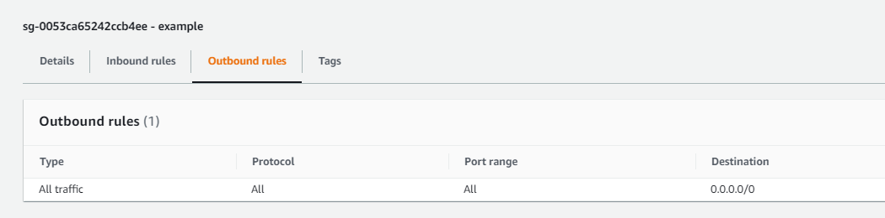
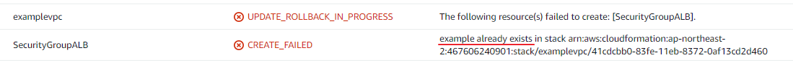

- [주의](#주의)
- [cloudformation 단점](#cloudformation-단점)
- [auto scaling 스트레스테스트 추천 도구](#auto-scaling-스트레스테스트-추천-도구)
- [기록](#기록)

# 주의
* scaling up&out 설정 뿐만 아니라 scaling down&in 설정도 필요
  * down&in 설정을 하지 않으면 생성된 ec2 인스턴스가 무한히 실행

<br>

# cloudformation 단점
* 관리가 어려움
  * 속성이 변경되면 기존 것을 참고해서 변경하는 것이 아니므로 오류 발생
    * 다시 리소스를 삭제해서 생성해야 함 

<br>

# auto scaling 스트레스테스트 추천 도구
* jmeter

<br>

# 기록
* alb는 AMI가 필요없고 Target Group만 필요
* TargetGroup에는 VPC, health check, listen port, security group 설정
* 리소스 이름 가져오기(여러가지 방법 존재)
```yaml
Resources:
  demo-resource:
    Tags:
    - Key: Name
      Value: !Sub ${AWS::StackName}
```
* SecurityGroup ALL 설정
```yaml
Resources:
  PublicAutoScalingSecurityGroup:
    Type: AWS::EC2::SecurityGroup
    SecurityGroupEgress:
      - IpProtocol: -1
        CidrIp: 0.0.0.0/0
```



* autoscaling을 만들 떄 필수 Tag 존재
```yaml
Resources:
  AutoScalingGroup:
    Tags:
    - Key: Environment
      Value: dev
      PropagateAtLaunch: "true"
```


* (todo) autoscaling threshold

* securitygroup groupname은 unique



* autoscalinggroup에 alb적용시 주의사항
  * TargetGroupARNs에 loadbalancer설정
  * LoadbalancerNames는 classic타입만 지원
```yaml
Resources:
  AutoScalingGroup:
    Properties
      TargetGroupARNs:
      - !Ref xxxx
```


* cloudwatch 시작 시간 로그 확인
  * cloudwatch > OK > conditions 확인
  * auto scaling에 설정한 scaling 로그가 conditions에 기록


* autoscaling 조건이 만족되면 in alarm으로 이동하고 scaling 시작?

