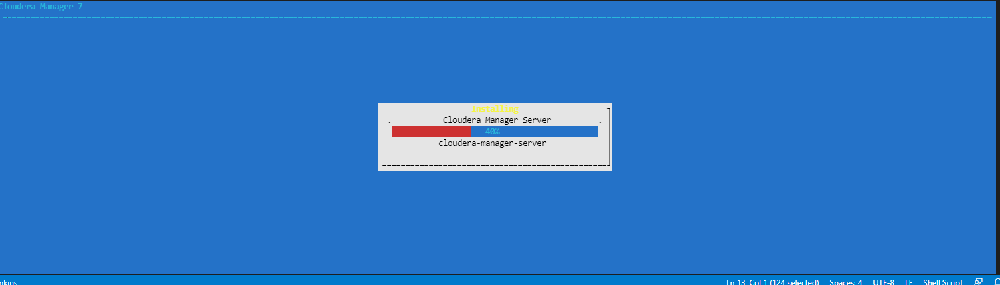

# 준비과정
> 참고자료: https://docs.cloudera.com/documentation/enterprise/latest/topics/installation_reqts.html#pre-install

* vagrant가 자동 설치 진행. 아래 목록은 설정 내용
  * jdk8 설치 <-- 스킵
  * 방화벽 비활성화
  * chrony 또는 ntp 설치
  * python 2.7 설치 <-- 스킵
  * selinux 비활성화

<br>

# 설치방법
## 설정
* config.yaml에서 IP, CPU, Memeory정보 수정

## 실행
```
vagrant up
vagrant ssh cloudrea-server1
```

## cloudrea설치
* 수동으로 평가판 버전 설치바이너리 실행
```
sudo su
sudo ./cloudera-manager-installer.bin
```

* 설치는 CUI로 진행


* 설치가 끝나면 접속페이지 제공


## 라이센스 입력
* 라이센스가 없으므로 평가판 선택


