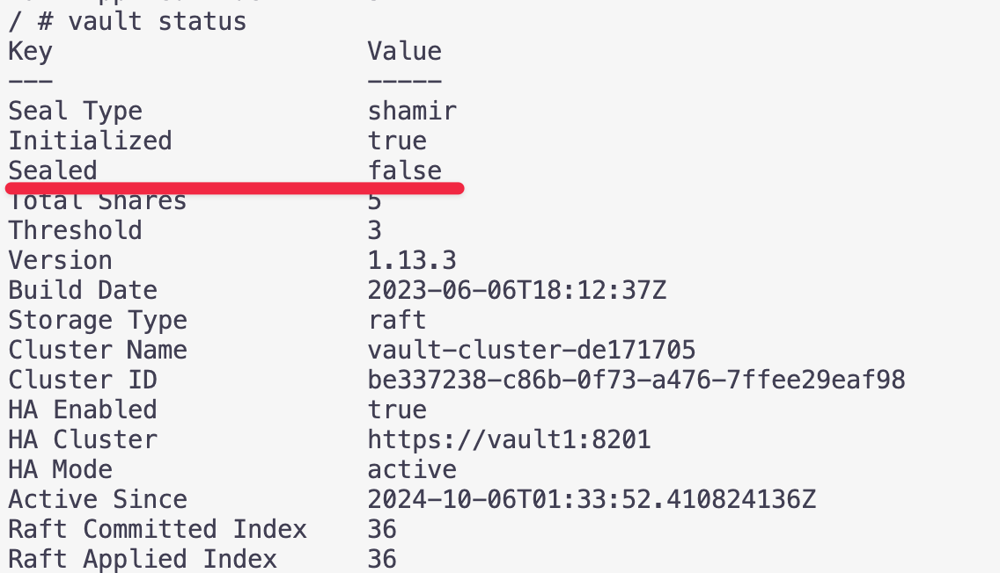
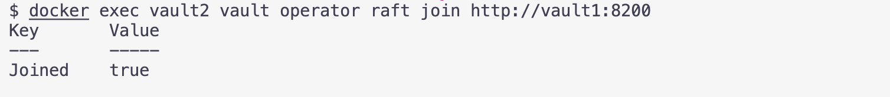
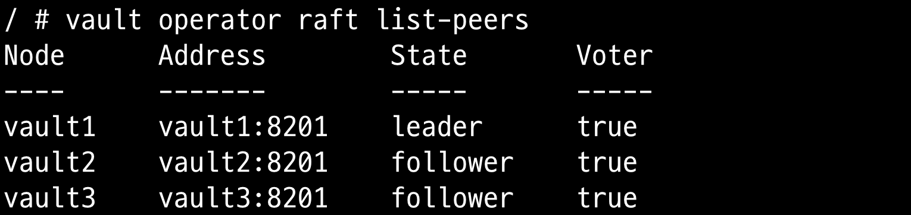

# 개요
* vault를 설치
* [standalone mode](./docker/standalone/)
* [HA mode](./docker/ha/)

# standalone 모드 설치 방법

* docker compose 실행

```sh
cd ./docker/ha
docker compose up -d
```

* vault1번 노드에서 vault cluster 초기화(unseal, root를 꼭 보관)

```sh
cd ./docker/ha
docker exec vault1 vault operator init
docker exec vault1 vault status
```

* vault1번 노드에서 unseal상태로 변경

```sh
docker exec -it vault1 /bin/sh

# unseal을 총 3번 실행
container# vault operator unseal
container# vault operator unseal
container# vault operator unseal

# vault status로 unseal되었는지 확인
container# vault status
```




* 나머지 노드에서 vault cluster 조인

```sh
cd ./docker/ha

# vault1노드에서 unseal상태로 설정
docker exec vault2 vault operator raft join http://vault1:8200
docker exec vault3 vault operator raft join http://vault1:8200
```



* 나머지노드에서 vault unseal상태로 변경

```sh
# 2번노드에서 unseal상태로 변경
docker exec -it vault2 /bin/sh

# unseal을 총 3번 실행
container# vault operator unseal
container# vault operator unseal
container# vault operator unseal

# vault status로 unseal되었는지 확인
container# vault status

# 3번 노드에서 unseal상태로 변경
docker exec -it vault3 /bin/sh

# unseal을 총 3번 실행
container# vault operator unseal
container# vault operator unseal
container# vault operator unseal

# vault status로 unseal되었는지 확인
container# vault status
```

* vault1번노드에서 raft 상태 확인

```sh
docker exec vault1 vault operator raft list-peers
```



# 참고자료
* https://developer.hashicorp.com/vault/tutorials/getting-started/getting-started-deploy
